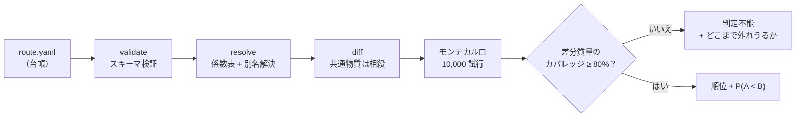
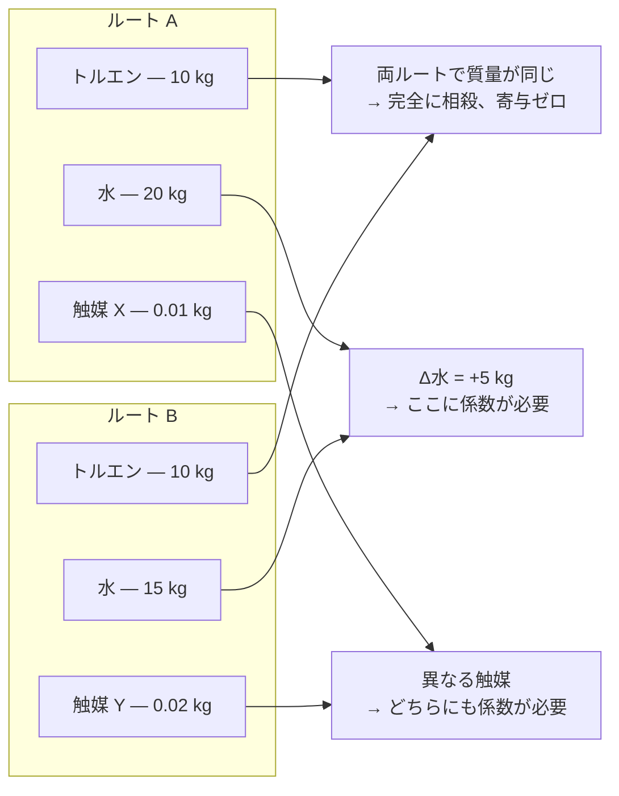

<!-- markdownlint-disable MD013 -->
<p align="right"><a href="README.md">English</a> | <strong>日本語</strong></p>

# carbonroute

**同じ製品を作る2つの方法のうち、どちらが低炭素か——そして、それはどのくらい確からしいか？**

`carbonroute` はこの問いにだけ答えるツールである。「この合成の絶対的なカーボン
フットプリントはいくつか」には答えない——それには両ルートのすべての原料について
背景データが必要で、大半は無料では手に入らない。必要なのは**2つのルートで
違う部分**のデータだけである。共通する部分は差し引きで相殺されるからだ。
これはずっと小さく、ずっと安価に解ける問題であり、公開データだけで実際に
解ける問題でもある。

答えは常に**順位と確率**として返る——「ルートBの方がほぼ確実に低い（P = 0.94）」
のように。単なる数値や、根拠のない当てずっぽうを返すことはない。

> これは v0 であり、審査・認証ツールではなくスクリーニングツールである。
> 出力は **ISO 14067 準拠のカーボンフットプリントではない**。何かに使う前に
> [「本ツールがやらないこと」](#本ツールがやらないこと)と
> [`docs/limitations.md`](docs/limitations.md) を読んでほしい。

```
pip install -e .
carbonroute compare route.yaml --a routeA --b routeB
```

---

## 30秒で動かしてみる

同じ架空の製品への、2つの架空のルート。このリポジトリに入っているものだけで、
今すぐ自分で実行できる：

```bash
carbonroute compare examples/route.yaml \
  --a legacy --b denovo \
  --factors examples/factors_illustrative.csv
```

```
## Conclusion

**New route is very likely lower** than Published route (P > 0.9999).

Delta (Published route - New route): median 126.4 kgCO2e/FU,
90% interval [70.94, 237.3], 10000 draws, seed 20240101.
```

この10,000回の試行はそれぞれ、「実際の排出係数がありうる範囲のどこかにあると
したら、今回はどちらのルートが勝つか」を丸ごとシミュレートしたものである。
ここでは10,000回すべてが一致している：

<p align="center">
  
</p>

ここにあるのは実データではない——`examples/factors_illustrative.csv` の値は
すべて誰が見ても分かる架空のキリのいい数字であり、レポート本文でもその旨が
大きく警告される。これは、自分で実データを1つも用意していない段階でも、
パイプライン全体の動きを見られるようにするためのものである。

## 仕組み



一番重要な工程は **diff（差分）** である。同じ製品への2つのルートは、多くの
場合かなりの部分を共有している——同じ溶媒、同じ試薬、時には同じ触媒。それら
には出典付きの排出係数はまったく要らない。差し引きの両辺で同一だからである：



（この発想は [DeltaLCA](https://arxiv.org/abs/2311.09611) のもので、
本ツールはそれを電子機器ではなく合成ルートに応用している。）

人間が決めるべき事柄——想定する電力系統、溶媒回収率、GWP の時間地平、何を
統計的な「引き分け」とみなすか——はすべて台帳ファイルの `assumptions:` 節
という一箇所に集約されている。それより先の計算はすべて決定論的である：
同じ台帳と同じ係数表からは、小数点以下まで常に同じ数値が出る。

## 実証してみせる——実際の論文の比較

上のデモは架空データだった。ここでは、査読を経た実際の論文のルート比較で
何が起きるかを見せる。

[Sorgenfrei et al., *J. Am. Chem. Soc.* **2025**, 147, 40944](https://doi.org/10.1021/jacs.5c14470)
（オープンアクセス）は、抗ウイルス薬**レテルモビル**への実在する2つのルート
——Merck が実際に使う工業ルートと、著者らが新たに設計したルート——の
cradle-to-gate 排出量を、本プロジェクトが再配布できない商用データベース
**ecoinvent** を使って計算した。結果は Merck ルートが 382 kgCO₂e/kg、
新ルートが 369 kgCO₂e/kg——新ルート優位で**約3%の差**だった。

`carbonroute` は ecoinvent を見ることができない。見えるのは公開ライセンスの
データだけであり、それはこの種の作業に取り組むほぼ誰もが実際に置かれている
状況でもある。同じ2つのルートに対して、公開データソースを追加していくと
何が起きるかを見てほしい：

<p align="center">
  
</p>

最初の段階では、本ツールは**間違えていたはずだった**——差分質量のわずか8.9%
しか解決できていない状態で、見えている数値は Merck ルートの方が低いという
方向に傾いており、これは論文の結論と逆だった。`carbonroute` はその結論を
出すことを拒んだ：

```
## Conclusion

**The comparison is undecided**, because only 8.9% of the differing mass
(2 of 43 materials) resolved to a factor, below the declared minimum of 80%.
No ranking is reported.
```

実在する引用可能な公開ソースを追加し、さらにどのデータベースにも載っていない
化学物質については、公表された製造プロセスのデータから係数を**導出する**
仕組み（[`docs/bootstrap.md`](docs/bootstrap.md) 参照）を備えたことで、
カバレッジは **75.5%** まで上昇し、証拠の向きは論文の結論と一致する方向へ
反転した。それでも判定は依然として `indeterminate`（判定不能）のままである
——75.5% はまだツールが順位を確定させるために要求する80%に届いていない
からであり、この「拒否」こそが欠陥ではなく本質である：

```
Resolved part of the difference: 50.28 kgCO2e/FU.
Unresolved differing mass: -4.205 kg/FU (signed).

The ranking reverses if the 4.205 kg/FU of unresolved material averages
more than 11.96 kgCO2e/kg. Compare that against the factors you do have
before treating the ranking as settled.
```

これは、残り24.5%の未解決分がどれだけ外れていたら結論が変わるかを、ツールが
正確に教えてくれているということである——根拠のない確信ではなく、自分の
直感と実際に照らし合わせられる数字である。このベンチマークが存在する理由と、
それが何を検出したかの全体像は [`benchmarks/README.md`](benchmarks/README.md)
にある。

レテルモビルは都合よく選んだ例ではない。査読を経た実際の論文によるルート比較を
さらに2件、同じパイプラインにかけたところ——イブプロフェン（カバレッジ52.9%）と
ZIF-8 金属有機構造体（カバレッジ6.8%）——同じ壁にぶつかった。特殊な溶媒の公開
係数データは薄く、ツールは推測するより順位付けを拒む方を選ぶ。両方の詳細と、
根拠となるデータが AI/機械学習によるモデル推定だったために調査の末に却下した
論文の記録は [`examples/case-studies/`](examples/case-studies/) にある。

## 値を全て知らなくても順位付けできる：境界（bounds）

80%というカバレッジ基準は高いハードルであり、実在するほとんどの比較は
公開データだけではこれをクリアできない。しかし**2つのルートの順位付けは、
どちらかを実測するより簡単な問題**である——欠けている係数が実際に
**何であるか**を知る必要はなく、それが順位を変えうるほど大きいかどうかが
分かれば十分だからだ。`carbonroute compare --bounds bounds.yaml` は、
この違いを実際に使える形にする。

係数が不明な物質それぞれについて、「この係数はXからYの間にある」という
区間を、根拠とともに与える（質量収支からの議論、既に保持している近縁物質の
係数、互いに食い違う2つの公表値を下限・上限として使う、など）。ツールは
その区間の組み合わせが取りうる**あらゆる値**にわたって、`GWP_A − GWP_B`
の符号が変わらないかを検証する。差分は各係数について線形なので、これは
探索ではなく2回の評価——差分が取りうる最大値と最小値——だけで済む。符号が
一度も変わらなければ、与えた区間と整合するどんな真の値についても順位が
証明されたことになる。これは単一の点推定よりも強い保証である。なぜなら
その推定が「正しい」ことに依存せず、区間がその値を含むだけの広さを持って
いることにしか依存しないからだ。符号が変わる場合は、その代わりに、
どの物質がどの値を超えれば結論が決まるかを正確に返す。

境界値が係数として扱われることは一切ない：モンテカルロ・シミュレーションに
入ることも、報告される合計値に寄与することも、カバレッジの割合を変えることも
ない。

### 具体例：カバレッジ52.9%でも判定確定

[Grimaldi et al., *ACS Sustainable Chem. Eng.*
**2021**](https://doi.org/10.1021/acssuschemeng.1c02309) は、2つのイブプロフェン
合成経路——フローケミストリー法（`bogdan`）と、その1段階を酵素反応に置き換えた
変種（`enzymatic`）——を比較している。公開係数では差分質量の52.9%しか解決
できず、9物質が未解決のまま残る。通常ならここで自動的に `indeterminate`
（判定不能）となる。この9物質に境界を与えると：

> **Decided: `bogdan` is lower than `enzymatic` everywhere in the asserted bounds.**
> （判定：主張された境界の中のどこを取っても `bogdan` の方が低い）

| material | delta_mass kg/FU | needs to be | asserted bound | clears it |
|---|---|---|---|---|
| 1-butyl-3-methylimidazolium hexafluorophosphate | -8.412 | above 1.715 kgCO2e/kg | [3.5, unbounded] | yes |
| trimethyl orthoformate | -1.666 | any value — cannot flip it | [0.27, unbounded] | yes |
| phosphate buffer solution, 0.05 M | -1.616 | any value — cannot flip it | [0.55, 2] | yes |
| *…残り5物質、その全て* | | *any value — cannot flip it* | | *yes* |

未解決9物質のうち7つは、境界内のどんな値を取っても結果を変えられない。
比較全体は、イオン液体1つについての1本の不等式に帰着する：その係数は
1.715 kgCO2e/kg を超えるか？　最も近い類縁体について公表されている2つの
推定値——互いに8倍食い違っている——は、いずれもこの閾値を2.0倍・15.9倍の
マージンでクリアする。推定値同士は一致しないが、判定については一致する。

このイオン液体は反応溶媒であり、バッチ間で回収・再利用が可能なため、
結果はどれだけ実際に回収されるかに条件付けられる：回収率51.0%まではこの
結論が成り立ち、それを超えると判定不能に戻る。引用元の論文自身も回収率
50%と100%のシナリオで結果を報告しており、同じ方向の結論に達している——
本プロジェクトの数値は、データのごく一部だけを使い、論文が依拠する商用
データベースを一切使わずに、論文と同じ場所に落ち着く。

手法の詳細は [`docs/bounds.md`](docs/bounds.md)、各境界値とその根拠は
[`examples/case-studies/ibuprofen-bogdan-vs-enzymatic/`](examples/case-studies/ibuprofen-bogdan-vs-enzymatic/)
にある。

## インストール

Python 3.11 以上。

```bash
pip install -e .
```

依存パッケージは `pydantic`、`numpy`、`PyYAML`、`click` のみに限定している。
RDKit はオプション（`pip install -e ".[chem]"`）で、物質同定の補助に使うのみ
であり、ツールの実行には一切必須ではない。

## 台帳（ledger）

ルート台帳は1つのYAMLファイルである。正準の形式は `src/carbonroute/schema.py`
（pydantic モデル）で定義され、外部検証用に
[`schemas/route-ledger.schema.json`](schemas/route-ledger.schema.json) にも
反映されている。

```yaml
schema_version: "0.1"

assumptions:
  functional_unit: {mass_kg: 1.0, basis: product}
  boundary: cradle-to-gate
  grid_factor:
    id: JP-2024
    value_kgCO2e_per_kWh: 0.43
    source: "Analyst-declared placeholder; replace with the grid factor you can cite."
    uncertainty_class: assumption
  gwp_method: {name: IPCC-AR6, horizon_years: 100, feedbacks: false}
  solvent_recovery_default: 0.0
  waste_treatment: excluded
  monte_carlo: {iterations: 10000, seed: 20240101}
  indeterminate_band: {low: 0.4, high: 0.6}

routes:
  legacy:
    label: "Published route"
    steps:
      - id: 1
        yield: 0.82
        inputs:
          - {name: toluene, cas: "108-88-3", mass_kg: 12.0, role: solvent}
          - {name: "substrate A", cas: null, mass_kg: 1.0, role: reactant}
        electricity_kWh: 30.0
  denovo:
    label: "New route"
    steps: [...]
```

知っておくべき点：

- 各投入量の `mass_kg` は、その工程で実際に投入した質量である。機能単位への
  換算（下流の全工程の累積収率で割り戻す、仕様書7.1節）はツールが自動で
  行うので、自分で計算する必要はない。
- `role` は `solvent`（溶媒）、`reactant`（反応物）、`reagent`（試薬）、
  `catalyst`（触媒）、`auxiliary`（補助剤）のいずれかで、役割別の内訳表示に
  使われる。
- `cas` は分かる限り記入すべきである——これが係数表との、また異なるルートや
  工程に登場する同一物質どうしの主キーになる。CAS がない物質は正規化した
  名前をキーにフォールバックするが、これは弱い一致であり、その旨が報告
  される。
- `assumptions.solvent_recovery_default`（および物質ごとの `solvent_recovery`
  上書き）は、溶媒の投入質量のうちどれだけを新規投入ではなく補給分として
  扱うかを決める（仕様書7.2節）。既定値は0——何も指定しなければ回収は
  一切仮定されない。
- `routes` は線形の工程列でなければならない。v0 では2つの分岐が合流する
  ルートを台帳で表現する方法がない。

前提（assumptions）が置かれる場所は、この完全なルート台帳の中だけである。
それ以外の設定手段は存在しない。

## コマンド

| コマンド | 内容 |
| --- | --- |
| `carbonroute validate route.yaml` | スキーマ検証のみ。係数の参照も計算も行わない。 |
| `carbonroute resolve route.yaml [--show-missing]` | 全物質を係数表で検索し、一致・不一致を報告する。排出量計算は行わない。 |
| `carbonroute coverage route.yaml --a A --b B` | A対Bの差分質量のうち、読み込んだ係数表がどこまで解決できるかを件数・質量の両方で報告する。差分に未解決があれば終了コード3。 |
| `carbonroute compare route.yaml --a A --b B -o report.md` | 差分抽出・モンテカルロ順位判定・逆転閾値探索を含む本比較を実行し、レポートを出力する。 |
| `carbonroute bootstrap --processes data/processes -o out.csv` | どの公開データベースにも載っていない物質について、製造プロセスのレシピから係数を導出する（[`docs/bootstrap.md`](docs/bootstrap.md) 参照）。 |
| `carbonroute lock route.yaml -o route.lock.json` | 係数表のバージョン、解決した全ての値とその出所、乱数シードを固定し、第三者が同じ結果を再現できるようにする。 |

`resolve`・`coverage`・`compare`・`lock`・`bootstrap` は `--factors PATH`
（複数指定可、既定は `data/factors/` 配下の全CSV）と `--synonyms PATH`
（既定は `data/synonyms/` 配下の全CSV。台帳が使う名称を識別子に対応付ける
もの——[`docs/data.md`](docs/data.md) 参照）を受け付ける。`compare` と
`lock` は `--uncertainty PATH`（既定は同梱の `config/uncertainty.yaml`）を
受け付ける。`resolve` は不確実性モデルに一切触れないため対象外である。
`compare` はさらに `--iterations`、`--seed`、`--no-thresholds` を取る。
`validate` にオプションはない。`resolve` と `compare` には将来のネットワーク
経由の係数取得のための `--fetch` フラグが存在するが、v0では常にエラーで
終了する。**ネットワークアクセスは既定で無効であり、本ツールにはソケットを
開くコードパスが一切存在しない。** どのコマンドも唯一許される副作用は
`-o` で指定したファイルへの書き込みのみであり、`-o` を指定しない場合は
標準出力に出す。

### 一連の実行例

```bash
# 1. 構造チェックのみ。
carbonroute validate examples/route.yaml

# 2. 例示用の係数表に対して何が解決でき、それが唯一の表だった場合に
#    何が欠けるかを確認する。
carbonroute resolve examples/route.yaml \
  --factors examples/factors_illustrative.csv \
  --show-missing

# 3. 2つのルートを比較し、Markdown レポートを出力する。
carbonroute compare examples/route.yaml \
  --a legacy --b denovo \
  --factors examples/factors_illustrative.csv \
  -o report.md

# 4. 使用した係数の値・版・乱数シードを固定し、第三者が再現できるようにする。
carbonroute lock examples/route.yaml \
  --factors examples/factors_illustrative.csv \
  -o route.lock.json
```

`report.md` は冒頭で、(1) 本結果が ISO 14067 準拠の算定ではないこと、
(2) 適用した前提の全文、(3) 係数表の版とSHA-256ハッシュ、(4) 解決の出所別
内訳——をこの順で示してから、結論を述べる。`examples/factors_illustrative.csv`
の全行は `ILLUSTRATIVE` と印付けられているため、レポートには「この結論は
パイプラインの動作確認以外には使えない」という警告も大きく表示される。
結論そのものは常に順位と確率として提示される（`P(GWP_legacy < GWP_denovo)`、
`"A<B"` / `"B<A"` / `"indeterminate"` のいずれかの判定、差分の中央値と90%
区間）——単一の絶対値が見出しとして提示されることは決してない。

## 本ツールがやらないこと

このリストは見落としではなく意図的なものであり、今後急には縮まらない見込み
である（`docs/spec-ja.md` 5.2節と `docs/limitations.md` を参照）。v0 は
以下を行わない：

- **収束型ルートの扱い。** 線形の工程列のみをサポートする。2つの合成分岐が
  1つに合流するルートは、台帳のスキーマではそもそも表現できない。
- **実験室規模から工業規模への外挿。** 投入量は台帳の記載どおりに扱われる。
  ベンチスケールの反応と工業プロセスとの間で、溶媒使用量や加熱効率、収率が
  どう変化するかのモデルは存在しない。
- **使用段階・廃棄段階のモデル化。** 境界は cradle-to-gate に固定されている。
  製品がゲートを出た後のことは一切スコープ外である。
- **気候変動以外の影響領域のカバー。** 出力される量は GWP（kg CO2e）のみ。
  水使用量、毒性、土地利用など ISO 14044 のその他の影響領域はスコープ外
  である。
- **計算経路のどこであれ言語モデルを使うこと。** どの係数値も、どの解決の
  判断も、レポート中のどの数値も、言語モデルによって生成・調整されることは
  一切ない。これは、汎用LLMがLCA関連タスクで測定された信頼性の低さへの
  意図的な対応である（arXiv:2510.19886 は、11モデル・22のLCA関連タスクに
  わたる回答の37%に不正確または誤解を招く内容が含まれ、一部モデルでは
  引用の捏造率が最大40%に達したと報告している）。
- **逆合成によるルート生成。** `carbonroute` は与えられたルートを比較する
  のみであり、候補となる合成経路を提案したり探索したりはしない。

そして上記のリストとは別に：**本ツールの出力は ISO 14067 準拠のカーボン
フットプリントではない。** これは、どのルートを本格的な評価にかけるかを
判断するためのスクリーニング比較であり、本格評価の代替物ではない。この点は
仕様書9節の要求どおり、すべてのレポートに明示される。

## `data/factors/` の中身

`data/factors/` には実データの排出係数が入っている。そのすべてが
`scripts/` 内のスクリプトによって、公開ライセンスのソースから取得された
ものであり、そのスクリプトを再実行すれば表を再生成できる。各行には出典
データセットと該当レコード、配布ライセンス、取得日、そして出典が公表して
いる場合はその不確実性が記録されている。

本稿執筆時点で **27物質**、5つのソースから成る：ADEME の Base Carbone
（Licence Ouverte）、US LCI Database（米国政府作成物）、ProBas/GEMIS
（ドイツ環境庁、万人が無償で利用可）、生産者・業界団体が直接公表した
値（PlasticsEurope のエコプロファイル、Nobian の EPD）、そして
`carbonroute bootstrap` 自身——どのデータベースにも載っていない化学物質
について、出典付きの製造プロセスのレシピから係数を導出する仕組み
（2-MeTHF、酢酸エチル、酢酸イソプロピル、アセトン、DMF、MTBE、
トリエチルアミンなど。[`docs/bootstrap.md`](docs/bootstrap.md) 参照）。

複数の物質は独立した公開ソース由来の値を2つ以上持っており、それらは常に
一致するわけではない——例えば塩酸は、あるソースでは1.199 kgCO2e/kg、
別のソースでは1.700 kgCO2e/kg である。レポートには使われている全ての値が
表示される。同一物質について公開データがどれだけばらつくかは、平均化して
消してしまうのではなく、知っておく価値のある情報として扱っている。

**実際の医薬品ルートと比べると、カバレッジはまだ小さい**——上のレテルモビル
の例を参照。再配布可能かつ独立に引用可能な、キログラム単位・cradle-to-gate
のファインケミカル溶媒・試薬向け係数は本当に希少であり、この分野で日常的に
使われている値の大半は本プロジェクトが再配布できない商用データベースの
中にある（誰がそれを持っていて、なぜか、そしてライセンスを持っている場合に
`carbonroute` へどう組み込むかは
[`docs/what-others-do.md`](docs/what-others-do.md) を参照）。
`carbonroute coverage` を使えば、自分の比較が80%までどれだけ足りないかが
正確に分かる——欠落は黙って省かれるのではなく、目の前の数字として示される。
ソースを追加するには取り込みスクリプトをもう1本書けばよい——
[`docs/data.md`](docs/data.md) と、既に調査済みのソースとその採否理由を
記録した [`docs/sources-investigated.md`](docs/sources-investigated.md) を
参照。

ここにある値はいかなるものも、推定・補間・記憶からの想起によるものでは
ない。これは「公開データのみ、何も創作しない」という原則（仕様書2節・13節）
の帰結である：もっともらしく見えるが誰も検証できない数字の表は、本ツールの
存在意義そのものを損なう。

`examples/factors_illustrative.csv` は、パイプラインを最初から最後まで
動かせるようにするためだけに存在する。中の値はすべて誰が見ても分かる架空の
キリのいい数字であり、各行の `source` 列は `ILLUSTRATIVE` で始まり、これを
使ったレポートは必ずその旨を大きく表示する。引用してはならず、上記コマンド
の動作確認以外の用途で使ってもならない。

## ライブAPIなしで全てを再現する

`carbonroute` 本体は一切ネットワークに触れない——これは単なる説明文では
なく、インポートグラフを解析するテストによって強制されている。一方、
`data/factors/` を「構築した」スクリプト群はかつてネットワークを必要と
しており、ADEME・PubChem・ProBas・Federal LCA Commons のAPIはいずれも
本プロジェクトの管理下にはない。各取り込みスクリプトには今や `--offline`
フラグがあり、ネットワークに触れる代わりに `data/raw/` 配下の永続的な
スナップショットから再生できる——どのスナップショットがどのソースを
カバーしているか、そして唯一残る未解決の穴については
[`docs/reproducibility.md`](docs/reproducibility.md) を参照。

レテルモビルベンチマークの実データ全体——小さくCC BYライセンスの確認が
取れたExcelワークブック——も同じ理由で
[`benchmarks/letermovir/source-material/`](benchmarks/letermovir/source-material/)
にコミットされている：`scripts/extract_letermovir_ledger.py --offline` を
引数なしで実行するだけで、このリポジトリに既にあるファイルのみを使って
`benchmarks/letermovir/ledger.yaml` をバイト単位で完全再現する。

## ベンチマーク

2つの試験集合があり、どちらも実装より先に合格条件を書いている（詳細は
[`benchmarks/README.md`](benchmarks/README.md)）。

**B1（解析的ケース）** は手計算で検証できるほど小さい。機能単位への換算、
溶媒補給量の計算、両ルートに共通する物質の厳密な相殺、そしてシードからの
ビット単位の再現性を固定している。

**B2（レテルモビル比較）** は上で示したものそのものである。計算コードより
先に書かれたベンチマークは、後から書かれたベンチマークでは検出できない
ものを検出する——このベンチマークが存在する前、未解決の物質は黙って
ゼロとして扱われており、差分質量のわずか8.9%の時点で、論文が公表した
順位とは逆の順位に対して `P > 0.9999` と報告していた。上で示したカバレッジ
の下限判定と逆転閾値の計算は、どちらもこのベンチマークが先に走って失敗
したからこそ存在する。

## さらに読む

- [`docs/data.md`](docs/data.md) — 係数表の形式と、引用可能な表の作り方。
- [`docs/bootstrap.md`](docs/bootstrap.md) — どのデータベースにもない
  物質について、製造プロセスのレシピから係数を導出する仕組み。
- [`docs/uncertainty.md`](docs/uncertainty.md) — モンテカルロモデルの
  仕組みと、そのパラメータの検証状況。
- [`docs/convergence.md`](docs/convergence.md) — モンテカルロの試行回数が
  十分と言えるための手順と、まだ確認できていないこと。
- [`docs/limitations.md`](docs/limitations.md) — 本ツールに何が期待でき、
  何が期待できないか。
- [`docs/reproducibility.md`](docs/reproducibility.md) — 非APIルート：
  ライブネットワークなしで全ての係数表を再現する方法。
- [`docs/what-others-do.md`](docs/what-others-do.md) — 業界のLCAツールが
  代わりに何をしているか、そしてライセンス済みデータベースを本ツールに
  接続する方法。
- [`docs/spec-ja.md`](docs/spec-ja.md) — 完全な設計仕様書（日本語）。上記
  すべての意図の典拠。
- [`docs/internal-api.md`](docs/internal-api.md) — コントリビューター向けの
  モジュール単位の契約。

## ライセンス

Apache License 2.0。[`LICENSE`](LICENSE) を参照。コードとデータは別々の
ライセンス体系にある：`src/` 配下のコードは Apache-2.0。`data/factors/` に
追加する係数表は、行ごとに記録された出典元のライセンスをそれぞれ継承する
（`docs/data.md` 参照）。
