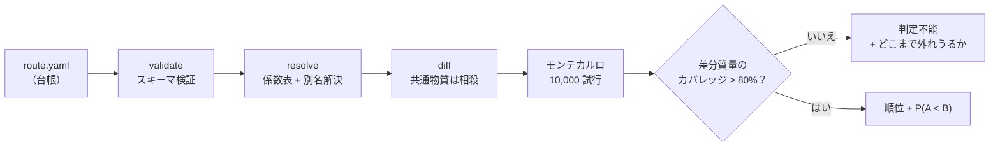
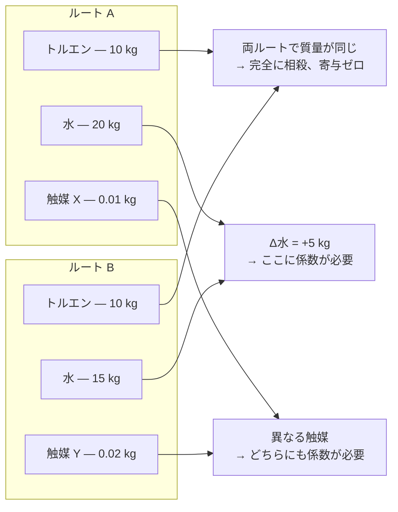

<!-- markdownlint-disable MD013 -->
<p align="right"><a href="README.md">English</a> | <strong>日本語</strong></p>

# carbonroute

**同じ製品を作る2つの方法のうち、どちらが低炭素か。そして、それはどれくらい確からしいか？**

`carbonroute` が答えるのはこの問いだけである。「この合成の絶対的なカーボン
フットプリントは何kgか」には答えない。それに答えるには、両方のルートで
使うすべての原料について背景データが必要になり、その大半は無料では
手に入らないからだ。

必要なのは**2つのルートで違う部分**のデータだけでよい。共通する部分は
差し引きで相殺され、消えてしまう。だからこれは、ずっと小さく、ずっと
安く解ける問題になる。公開データだけで実際に解ける問題になる、という
ことでもある。

答えは常に**順位と確率**として返ってくる。たとえば「ルートBの方がほぼ
確実に低い（P = 0.94）」のように。単なる数値や、根拠のない当てずっぽうを
返すことはない。

> これは v0 であり、審査・認証ツールではなく、スクリーニング（一次選別）
> ツールである。出力は **ISO 14067 準拠のカーボンフットプリントではない**。
> 何かに使う前に、[「本ツールがやらないこと」](#本ツールがやらないこと)と
> [`docs/limitations.md`](docs/limitations.md) を読んでほしい。

```
pip install -e .
carbonroute compare route.yaml --a routeA --b routeB
```

---

## 30秒で動かしてみる

同じ架空の製品への、2つの架空のルート。このリポジトリに入っている
ものだけで、今すぐ自分の手元で実行できる。

```bash
carbonroute compare examples/route.yaml \
  --a legacy --b denovo \
  --factors examples/factors_illustrative.csv
```

```
## Conclusion

**New route is very likely lower** than Published route (P > 0.9999).

Delta (Published route - New route): median 126.4 kgCO2e/FU,
90% interval [70.94, 237.3], 10000 draws, seed 20240101.
```

`carbonroute` は内部で「モンテカルロ法」というシミュレーションを走らせて
いる。1回の試行は、「実際の排出係数がありうる範囲のどこかにある」という
仮定のもとで、今回はどちらのルートが低炭素になるかを1回だけ調べる計算
である。それを1万回繰り返し、勝った回数の割合を確率として報告する。

上の例では1万回の試行すべてが「新ルートの方が低い」という結果になった：

<p align="center">
  
</p>

ここにあるのは実データではない。`examples/factors_illustrative.csv` の
値は、誰が見ても架空だと分かるキリのいい数字だけを使っている。レポート
本文でもその旨が大きな警告として表示される。これは、自分でまだ実データを
1つも用意していない段階でも、パイプライン全体の動きを一通り見られるように
するためのものである。

## 仕組み



一番重要な工程は **diff（差分）** である。同じ製品を作る2つのルートは、
実はかなりの部分を共有していることが多い。同じ溶媒、同じ試薬、時には
同じ触媒。そこには出典付きの排出係数はまったく要らない。引き算をすれば
両辺で打ち消し合って消えるからだ：



（この発想のもとになっているのは [DeltaLCA](https://arxiv.org/abs/2311.09611)
という研究である。本ツールは、それを電子機器ではなく化学合成のルートに
応用している。）

人間が判断すべき事柄——想定する電力系統、溶媒の回収率、GWP（地球温暖化
係数）の計算に使う時間幅、どこからを統計的な「引き分け」とみなすか——は
すべて、台帳ファイルの `assumptions:` という一箇所にまとめて書く。それより
先の計算はすべて機械的に決まる。同じ台帳と同じ係数表を使えば、小数点以下
まで常に同じ数値が出る。

## 実証してみせる：実際の論文での比較

上のデモは架空データだった。ここでは、査読を経た実在の論文のデータで
ルート比較をすると何が起きるかを見せる。

[Sorgenfrei et al., *J. Am. Chem. Soc.* **2025**, 147, 40944](https://doi.org/10.1021/jacs.5c14470)
（オープンアクセス）は、抗ウイルス薬**レテルモビル**への実在する2つの
ルートを比較した論文である。1つは製薬会社Merckが実際に使っている工業
ルート、もう1つは論文の著者らが新たに設計したルート。両方の
cradle-to-gate（原料採取から工場出荷まで）の排出量を、**ecoinvent**という
商用データベースを使って計算している。ecoinventは有償のデータベースで
あり、本プロジェクトはそのデータを再配布できない。論文が報告した数値は
Merckルートが382 kgCO₂e/kg、新ルートが369 kgCO₂e/kg——新ルートの方が
**約3%低い**という結果だった。

`carbonroute` はecoinventの中身を見ることができない。見えるのは公開
ライセンスのデータだけである。これは特殊な制約ではなく、この種の計算に
取り組むほとんどの人が実際に置かれている状況でもある。同じ2つのルートに
対して、使える公開データを少しずつ増やしていくと何が起きるか、見て
ほしい：

<p align="center">
  
</p>

最初の段階では、本ツールは**もし判定を出していたら間違えていたはず**
だった。差分質量のわずか8.9%しか公開データで解決できておらず、その少ない
手がかりだけを見ると「Merckルートの方が低い」という方向に傾いていた。
これは論文の結論とは逆である。`carbonroute` はこの状態で判定を出すことを
拒んだ：

```
## Conclusion

**The comparison is undecided**, because only 8.9% of the differing mass
(2 of 43 materials) resolved to a factor, below the declared minimum of 80%.
No ranking is reported.
```

（訳：この比較は判定不能である。差分質量のうち、係数が解決できたのは
わずか8.9%（43物質中2物質）であり、既定の最低基準である80%に届いて
いないため。順位は報告しない。）

そこから、実在する引用可能な公開データを追加していった。さらに、どの
データベースにも載っていない化学物質については、公表された製造プロセスの
データから係数を**自前で導出する**仕組み（[`docs/bootstrap.md`](docs/bootstrap.md)
を参照）も用意した。その結果、カバレッジは**75.5%**まで上がり、証拠が
指し示す方向も論文の結論と一致する側へ反転した。それでも判定は依然として
`indeterminate`（判定不能）のままである。75.5%は、ツールが順位を確定
させるために要求する80%にまだ届いていないからだ。この「まだ判定を
出さない」という拒否こそが、欠陥ではなく本質である：

```
Resolved part of the difference: 50.28 kgCO2e/FU.
Unresolved differing mass: -4.205 kg/FU (signed).

The ranking reverses if the 4.205 kg/FU of unresolved material averages
more than 11.96 kgCO2e/kg. Compare that against the factors you do have
before treating the ranking as settled.
```

（訳：差分のうち解決できた部分は50.28 kgCO2e/機能単位。未解決の差分質量は
-4.205 kg/機能単位（符号付き）。この未解決の4.205 kgが平均して
11.96 kgCO2e/kgを超えると、順位は逆転する。この順位を確定済みとして扱う
前に、手元にある他の係数と比べて妥当か確認してほしい。）

つまりこれは、「残り24.5%の未解決分がどれくらい外れていたら結論が
ひっくり返るか」を、ツールが正確に教えてくれているということである。
根拠のない確信を与えるのではなく、自分の直感と実際に照らし合わせられる
具体的な数字を渡してくれる。このベンチマークが存在する理由と、それが
何を検出したかの全体像は [`benchmarks/README.md`](benchmarks/README.md)
にある。

レテルモビルは都合よく選んだ例ではない。査読を経た実際の論文による
ルート比較をさらに2件、同じパイプラインにかけてみた。イブプロフェン
（カバレッジ52.9%）とZIF-8金属有機構造体（カバレッジ6.8%）である。
どちらも同じ壁にぶつかった。特殊な溶媒についての公開係数データは薄く、
ツールは当てずっぽうで埋めるよりも、順位付けを拒む方を選ぶ。この2件の
詳細と、根拠データがAI・機械学習によるモデル推定だったために調査の末に
却下した論文の記録は、[`examples/case-studies/`](examples/case-studies/)
にある。

## 境界（bounds）：値を全て知らなくても順位付けできる

80%というカバレッジ基準は高いハードルであり、実在するほとんどの比較は
公開データだけではこれをクリアできない。しかし、ここで1つ気づくことが
ある。**2つのルートの順位を決めるのは、どちらか一方の値を正確に測る
より簡単な問題**だということだ。欠けている係数が実際に**いくらか**を
知る必要はない。それが順位をひっくり返すほど大きいかどうかさえ分かれば
十分である。`carbonroute compare --bounds bounds.yaml` は、この違いを
実際に使える機能にしたものだ。

使い方はこうだ。係数が分からない物質それぞれについて、「この係数は
XからYの間にあるはずだ」という区間を、根拠とともに与える。根拠の例と
しては、質量収支からの計算、すでに手元にある似た物質の係数、あるいは
互いに食い違う2つの公表値をそのまま下限・上限として使う、といった
やり方がある。

ツールがすることは単純だ。その区間の組み合わせが取りうる**あらゆる値**に
ついて、「ルートAの排出量 − ルートBの排出量」の符号（プラスかマイナスか）
が一度も変わらないかどうかを調べる。差分はどの係数についても足し算・
引き算だけで決まる関係（数学的には「線形」という）なので、実はすべての
組み合わせを試す必要はなく、**差分が取りうる最大値と最小値の2パターン**
だけ計算すれば済む。この2つのどちらでも符号が変わらなければ、区間の中の
どんな値の組み合わせであっても順位は同じになる、ということが証明できた
ことになる。

これは、たった1つの推定値を使うより強い保証である。なぜなら、その推定値
が「当たっている」ことに一切頼っていないからだ。頼っているのは、区間が
真の値を含むだけの広さを持っている、という一点だけである。

符号が変わってしまう場合は、代わりに「どの物質の係数がいくつを超えれば
結論が決まるか」を正確な数値で返す。

境界の値がそのまま係数として使われることは一切ない。モンテカルロ・
シミュレーションに入ることもなければ、報告される合計値に足し込まれる
こともなく、カバレッジの割合を変えることもない。あくまで「順位が
決まるかどうか」を確かめるためだけに使われる、別枠の情報である。

### 具体例：カバレッジ52.9%でも判定は確定する

[Grimaldi et al., *ACS Sustainable Chem. Eng.*
**2021**](https://doi.org/10.1021/acssuschemeng.1c02309) は、2つの
イブプロフェン合成経路を比較した論文である。1つはフローケミストリー法
（`bogdan`）、もう1つはその最後の1段階を酵素反応に置き換えた変種
（`enzymatic`）だ。公開されている係数だけでは、差分質量の52.9%しか
解決できず、9つの物質が未解決のまま残る。普通ならここで自動的に
`indeterminate`（判定不能）になる。しかし、この9物質に境界を与えると
結果は変わる：

> **Decided: `bogdan` is lower than `enzymatic` everywhere in the asserted bounds.**
> （判定確定：主張した境界の中のどの値を取っても、`bogdan` の方が低い）

| material（物質） | delta_mass kg/FU（差分質量） | needs to be（結論を変えるための条件） | asserted bound（設定した境界） | clears it（境界内でこの条件を満たすか） |
|---|---|---|---|---|
| 1-butyl-3-methylimidazolium hexafluorophosphate（イオン液体） | -8.412 | 1.715 kgCO2e/kgを超える必要がある | [3.5, 上限なし] | yes（満たす） |
| trimethyl orthoformate | -1.666 | どんな値でも結論は変わらない | [0.27, 上限なし] | yes |
| phosphate buffer solution, 0.05 M（リン酸緩衝液） | -1.616 | どんな値でも結論は変わらない | [0.55, 2] | yes |
| *…残り5物質、すべて同様* | | *どんな値でも結論は変わらない* | | *yes* |

未解決の9物質のうち7つは、境界内のどんな値を取っても結果を変えられ
ない。つまり比較全体は、たった1つのイオン液体についての1本の不等式に
帰着する。「その係数は1.715 kgCO2e/kgを超えるかどうか」だけが問題に
なる。この物質にもっとも近い類縁物質について、公表されている推定値が
2つあるが、両者は互いに8倍も食い違っている。それでも、両方ともこの
閾値を2.0倍・15.9倍という余裕でクリアする。**2つの推定値は「いくつか」
では一致しないが、「どちらが大きいか」では完全に一致する。**

このイオン液体は反応溶媒であり、バッチ間で回収して再利用できる。その
ため結果は「実際にどれだけ回収されるか」に左右される。回収率51.0%までは
上の結論が成り立ち、それを超えると再び判定不能に戻る。興味深いことに、
引用元の論文自身も回収率50%と100%の2つのシナリオで結果を報告しており、
同じ方向の結論に達している。本プロジェクトの計算は、データのごく一部
だけを使い、論文が依拠している商用データベースを一切使わずに、論文と
同じ結論にたどり着いたことになる。

手法の詳細は [`docs/bounds.md`](docs/bounds.md) に、各境界値とその根拠は
[`examples/case-studies/ibuprofen-bogdan-vs-enzymatic/`](examples/case-studies/ibuprofen-bogdan-vs-enzymatic/)
にある。

## スクリーニング：18,500件の反応をまとめて調べる

ここまでに紹介したのは、誰かがすでに論文として公表した「2つのルートの
比較」だった。`carbonroute screen` は、反応データベース全体に対して、
もう少し狭い問いを立てる：**各酵素反応について、対応する化学プラントが
溶媒を何%回収すれば、酵素の優位性は消えてしまうか？**

### なぜこれが現実的な計算量で済むのか

近道をしているわけではない。`compare` を成立させているのと同じ「相殺」の
仕組みを、そのまま使っているだけだ。2つのルートが同じ生成物を作るとき、
両方に共通するものは全て差分から消える。そして酵素法と化学合成法を
比べるとき、消えるのはまさに、調べるのに一番手間がかかる部分——反応
ごとに違う基質と生成物——である。残るものは、種類が少なく、何度も
繰り返し登場するものだけだ：

| 側 | 差分に残るもの |
|---|---|
| 酵素側 | **補酵素**——UDP-グルコース、NADPH、SAM（S-アデノシルメチオニン）、アセチルCoA など |
| 化学側 | **保護基・活性化剤・塩基・溶媒** |

これは単なる予想ではなく、実際に数えて確かめた。酵素反応のデータベース
[Rhea](https://www.rhea-db.org/) には18,558件の反応があり、そこに現れる
物質の種類は14,251種にのぼる。しかし、**100件以上の反応に登場するのは
わずか63種、1,000件以上に登場するのはたった12種**しかない。そして
上位30種だけで、データベース全体の「反応×登場物質」の組み合わせの
47.8%を占めてしまう。この上位リストの中身は、生化学の研究者が暗記して
いるような補酵素のリストそのものだった。上位30種が取りこぼす残り約半分は、
まさに反応ごとに異なる基質と生成物であり、これは差分計算の中で相殺
されて消える部分である。

したがって、排出係数をそろえる作業量は、この「よく出てくる物質」の
語彙の大きさ——数十種類——で頭打ちになり、反応の総数には比例しない。
必要な係数さえそろえてしまえば、あとは1反応あたり算術計算1回で済む。
263件の反応クラスなら、計算時間は約1秒である。

### 何を報告するのか、なぜ「勝敗」を報告しないのか

スクリーニングは、各酵素反応を**クラステンプレート**——実在する1件の
公表済み化学手順を、そのクラスに属する全ての基質に当てはめたもの——と
組み合わせて比較する。この「1つの手順を他の基質にも当てはめる」という
外挿こそが、この手法の中心的な仮定である。そのため出力は、「本物の
`compare` に時間をかける価値がある反応の、順位付きショートリスト」で
あって、個々の反応についての最終判定では決してない。

主要な数値をあえて「酵素が何回勝ったか」にしていないのにも理由がある。
クラステンプレートのもとになっているのは、公表された**実験室規模**の
手順である。実験室の手順は、たいてい溶媒を惜しみなく使い捨てる——実際、
同梱のテンプレートは、生成物1kgあたり800kgを超える溶媒を計上している。
実際の工場はそんなことをしない。そこで報告する数値は、各反応の判定が
成り立たなくなる**溶媒回収率の閾値**である。この数値には、外部の物差しが
ある。工業的な蒸留による溶媒回収率は、通常90〜95%だからだ。

### UDP-グルコース転移酵素、263件の反応での結果

Cepanec & Litvić（*ARKIVOC* 2008年）が報告したHelferich/BF₃法による
グリコシル化反応を、化学側のテンプレートとしてスクリーニングした結果は
次の通りである：

| 統計量 | 回収率の閾値 |
|---|---|
| 最小 | 85.58% |
| 中央値 | 85.87% |
| 最大 | 91.43% |

**判定が確定した256件の反応のうち、溶媒回収率99%に耐えられるものは
1件もなかった。** 分布全体が、実プラントで達成可能な水準（90〜95%）を
下回っている。正直な読み方は「酵素が256回勝った」ではなく、**「この
反応クラスにおいて、この実験室手順をもとにモデル化する限り、酵素の
優位性は確かに存在するが限定的であり、工業的な溶媒リサイクルの前では
消えてしまう」**というものである。これは反証可能な主張であり、単なる
勝敗数を数えるより、はるかに有用な情報である。

このスクリーニングが本来測定しようとしていた仕組みも、データのばらつき
の中にはっきりと現れた。閾値は、**化学ルートが保護しなければならない
基質側の官能基の数が多いほど高くなる**——官能基が1個以下なら85.58%、
33個もある大きなオリゴ糖では91.43%——という具合だ。化学合成が保護・
脱保護しなければならない部位が増えるほど、酵素の持つ位置選択性
（狙った場所だけに反応させる性質）の価値が上がる、ということである。
これは、分子の構造情報だけから定量的に示された、酵素の優位性そのもの
だと言える。

### 較正（キャリブレーション）

RHEA:12560——ヒドロキノン + UDP-α-D-グルコース → β-アルブチン——という
反応は、このクラスの一員であると同時に、
[`examples/case-studies/beta-arbutin-chemical-vs-enzymatic/`](examples/case-studies/beta-arbutin-chemical-vs-enzymatic/)
で、全ての出典を1つ1つ確認しながら手作業で構築した事例そのものでも
ある。スクリーニングの結果は、この手作業版と生成物の質量・受容体
（基質）・補酵素の投入量・判定の方向のすべてが一致し、これはテストで
固定して保証している。この一致がなければ、残り262件の結果は、単に
自分自身のテンプレートをなぞって報告しているだけになってしまう。

手法の詳細は [`docs/screening.md`](docs/screening.md) に、実測した
補酵素の語彙は [`data/rhea/README.md`](data/rhea/README.md) にある。

## インストール

Python 3.11 以上が必要である。

```bash
pip install -e .
```

依存パッケージは `pydantic`、`numpy`、`PyYAML`、`click` のみに絞って
いる。RDKit はオプション（`pip install -e ".[chem]"`）であり、物質同定の
補助と反応データベースのスクリーニング機能に使うだけで、ツールの基本
動作には一切必須ではない。

## 台帳（ledger）

ルート台帳は1つのYAMLファイルである。正式な形式は
`src/carbonroute/schema.py`（pydanticモデル）で定義されており、外部での
検証用に [`schemas/route-ledger.schema.json`](schemas/route-ledger.schema.json)
にも同じ内容が反映されている。

```yaml
schema_version: "0.1"

assumptions:
  functional_unit: {mass_kg: 1.0, basis: product}
  boundary: cradle-to-gate
  grid_factor:
    id: JP-2024
    value_kgCO2e_per_kWh: 0.43
    source: "Analyst-declared placeholder; replace with the grid factor you can cite."
    uncertainty_class: assumption
  gwp_method: {name: IPCC-AR6, horizon_years: 100, feedbacks: false}
  solvent_recovery_default: 0.0
  waste_treatment: excluded
  monte_carlo: {iterations: 10000, seed: 20240101}
  indeterminate_band: {low: 0.4, high: 0.6}

routes:
  legacy:
    label: "Published route"
    steps:
      - id: 1
        yield: 0.82
        inputs:
          - {name: toluene, cas: "108-88-3", mass_kg: 12.0, role: solvent}
          - {name: "substrate A", cas: null, mass_kg: 1.0, role: reactant}
        electricity_kWh: 30.0
  denovo:
    label: "New route"
    steps: [...]
```

知っておくべき点は次の通りである：

- 各投入量の `mass_kg` は、その工程で実際に投入した質量をそのまま
  記入する。機能単位（最終的に比較する基準となる量）への換算——下流の
  全工程の累積収率で割り戻す計算（仕様書7.1節）——はツールが自動で
  行うので、自分で計算する必要はない。
- `role`（役割）は `solvent`（溶媒）、`reactant`（反応物）、
  `reagent`（試薬）、`catalyst`（触媒）、`auxiliary`（補助剤）の
  いずれかを指定する。役割ごとの内訳を表示する際に使われる。
- `cas`（CAS登録番号）は、分かる限り必ず記入すべきである。これが
  係数表との照合や、異なるルート・工程に登場する同一物質を結びつける
  ときの主キーになる。CAS番号がない物質は、名前を正規化したものを
  キーとして代用するが、これは照合の精度が落ちる弱い一致であり、その
  旨がレポートに明記される。
- `assumptions.solvent_recovery_default`（と、物質ごとに個別指定できる
  `solvent_recovery`）は、投入した溶媒のうちどれだけを「新規に投入した
  もの」ではなく「回収して補給しただけのもの」として扱うかを決める
  設定である（仕様書7.2節）。既定値は0、つまり何も指定しなければ回収は
  一切ないものとして計算する。
- `routes`（ルート）は、必ず一本道の工程列として記述しなければ
  ならない。v0では、2つの合成経路が途中で1つに合流するようなルートを
  台帳で表現する方法がない。

前提条件（assumptions）を書ける場所は、この完全なルート台帳の中だけ
である。それ以外に設定を書く手段は存在しない。

## コマンド

| コマンド | 内容 |
| --- | --- |
| `carbonroute validate route.yaml` | スキーマ検証のみを行う。係数の参照も排出量計算も一切行わない。 |
| `carbonroute resolve route.yaml [--show-missing]` | 台帳に出てくる全物質を係数表で検索し、一致した物質・しなかった物質を報告する。排出量の計算はまだ行わない。 |
| `carbonroute coverage route.yaml --a A --b B` | ルートAとBの差分質量のうち、読み込んだ係数表でどこまで解決できるかを、件数と質量の両方で報告する。未解決分が残っている場合、終了コード3を返す。 |
| `carbonroute compare route.yaml --a A --b B -o report.md` | 差分抽出・モンテカルロ順位判定・逆転閾値の探索を含む、本比較を実行してレポートを出力する。 |
| `carbonroute bootstrap --processes data/processes -o out.csv` | どの公開データベースにも載っていない物質について、製造プロセスのレシピから係数を導出する。詳細は [`docs/bootstrap.md`](docs/bootstrap.md)。 |
| `carbonroute screen --template CLASS.yaml --bounds B.yaml` | 反応データベース全体を、1つの化学ルートのテンプレートに対してスクリーニングし、反応ごとの溶媒回収率の閾値を報告する。詳細は [`docs/screening.md`](docs/screening.md)。 |
| `carbonroute lock route.yaml -o route.lock.json` | 使用した係数表のバージョン、解決した全ての値とその出所、乱数シードを固定し、第三者が同じ結果を再現できるようにする。 |

`resolve`・`coverage`・`compare`・`lock`・`bootstrap` は、いずれも
`--factors PATH`（繰り返し指定可能。既定では `data/factors/` 配下の
全CSVを使う）と `--synonyms PATH`（既定では `data/synonyms/` 配下の
全CSVを使う。台帳で使う物質名を識別子に対応付けるための表であり、詳細は
[`docs/data.md`](docs/data.md)）を受け付ける。`compare` と `lock` は
さらに `--uncertainty PATH`（既定では同梱の `config/uncertainty.yaml`）を
受け付ける。`resolve` は不確実性モデルに一切触れないコマンドなので、
この対象外である。`compare` はこれに加えて `--iterations`、`--seed`、
`--no-thresholds` を受け付ける。`validate` にはオプションが一切ない。
`resolve` と `compare` には、将来ネットワーク経由で係数を取得するための
`--fetch` フラグが用意されているが、v0では常にエラーで終了する。
**ネットワークアクセスは既定で無効になっており、本ツールのコードには
そもそもソケットを開く経路が一切存在しない。** どのコマンドについても、
唯一許されている副作用は `-o` で指定したファイルへの書き込みだけで
あり、`-o` を指定しなければ標準出力に結果を表示する。

### 一連の実行例

```bash
# 1. 構造チェックのみを行う。
carbonroute validate examples/route.yaml

# 2. 例示用の係数表に対して何が解決できるか、
#    そしてこの表しかなかった場合に何が足りないかを確認する。
carbonroute resolve examples/route.yaml \
  --factors examples/factors_illustrative.csv \
  --show-missing

# 3. 2つのルートを比較し、Markdownレポートを出力する。
carbonroute compare examples/route.yaml \
  --a legacy --b denovo \
  --factors examples/factors_illustrative.csv \
  -o report.md

# 4. 使用した係数の値・バージョン・乱数シードを固定し、
#    第三者が同じ結果を再現できるようにする。
carbonroute lock examples/route.yaml \
  --factors examples/factors_illustrative.csv \
  -o route.lock.json
```

`report.md` の冒頭には、順に (1) この結果がISO 14067準拠の算定では
ないという注記、(2) 適用した前提条件の全文、(3) 係数表のバージョンと
SHA-256ハッシュ、(4) 出所別の解決内訳が並び、その後に結論が続く。
`examples/factors_illustrative.csv` の各行はすべて `ILLUSTRATIVE`
（架空データ）と印付けされているため、これを使ったレポートには
「この結論はパイプラインの動作確認以外には使えない」という大きな
警告も表示される。結論そのものは、常に順位と確率として提示される
——`P(GWP_legacy < GWP_denovo)`（確率）、`"A<B"` / `"B<A"` /
`"indeterminate"`（判定）、差分の中央値と90%区間——単一の絶対値が
見出しとして示されることは決してない。

## 本ツールがやらないこと

このリストは実装の見落としではなく、意図的な線引きである。今後すぐに
縮まる見込みもない（`docs/spec-ja.md` 5.2節と `docs/limitations.md` を
参照）。v0では、以下のことは行わない：

- **複数の経路が合流するルートの扱い。** サポートするのは一本道の工程列
  だけである。2つの合成分岐が1つに合流するようなルートは、台帳の
  スキーマではそもそも表現できない。
- **実験室規模から工業規模への外挿。** 台帳に書かれた投入量は、そのまま
  そのとおりに扱われる。ベンチスケールの反応と工業プロセスとの間で、
  溶媒の使用量や加熱効率、収率がどう変わるかをモデル化する機能は
  ない。
- **使用段階・廃棄段階のモデル化。** 計算対象の範囲（システム境界）は
  cradle-to-gate（原料採取から工場出荷まで）に固定されている。製品が
  工場から出た後のことは、一切スコープの外である。
- **気候変動以外の環境影響の網羅。** 出力される数値はGWP（地球温暖化
  係数、単位はkg CO2e）だけである。水使用量、毒性、土地利用といった
  ISO 14044が定めるその他の影響領域は対象外である。
- **計算のどこかで言語モデルを使うこと。** どの係数値も、どの解決の
  判断も、レポート中のどの数値も、言語モデルによって生成されたり
  調整されたりすることは一切ない。これは、汎用の大規模言語モデルが
  LCA関連のタスクで測定された信頼性の低さに対する、意図的な対応である
  （arXiv:2510.19886という研究は、11個のモデルに22種類のLCA関連タスクを
  行わせたところ、回答の37%に不正確または誤解を招く内容が含まれ、
  一部のモデルでは架空の引用をでっち上げる割合が最大40%に達したと
  報告している）。
- **逆合成によるルートの自動生成。** `carbonroute` は、与えられた
  ルートどうしを比較するだけである。新しい合成経路の候補を提案したり、
  自動で探索したりすることはない。

そして、このリストとは別にもう1点。**本ツールの出力はISO 14067準拠の
カーボンフットプリントではない。** これは、どのルートを本格的な評価に
かけるべきかを判断するための、スクリーニング（一次選別）用の比較で
あり、本格的な評価そのものの代わりにはならない。この点は仕様書9節の
要求どおり、すべてのレポートに明示される。

## `data/factors/` の中身

`data/factors/` には、実際の排出係数データが入っている。そのすべてが
`scripts/` 内のスクリプトによって、公開ライセンスのソースから取得
されたものであり、同じスクリプトを再実行すれば表を再生成できる。表の
各行には、出典データセット名と該当レコード、配布ライセンス、取得日、
そして出典元が不確実性の情報を公表している場合はその数値までが記録
されている。

本稿執筆時点で、**27物質**、5つの出典から成る。ADEMEのBase Carbone
（フランスのオープンライセンス）、US LCI Database（米国政府作成物）、
ProBas/GEMIS（ドイツ環境庁が無償公開しているデータ）、生産者や業界
団体が直接公表した値（PlasticsEuropeのエコプロファイル、Nobianの
EPD）、そして `carbonroute bootstrap` 自身が導出した値である。この
最後の仕組みは、どのデータベースにも載っていない化学物質について、
出典付きの製造プロセスのレシピから係数を導き出すというもので
（2-MeTHF、酢酸エチル、酢酸イソプロピル、アセトン、DMF、MTBE、
トリエチルアミンなどに適用済み）、詳細は
[`docs/bootstrap.md`](docs/bootstrap.md) を参照してほしい。

複数の物質については、独立した2つ以上の公開ソースから値が得られて
おり、それらが必ずしも一致するわけではない。たとえば塩酸は、ある
ソースでは1.199 kgCO2e/kg、別のソースでは1.700 kgCO2e/kgとなって
いる。レポートには、実際に使われた全ての値が表示される。同じ物質でも
公開データにこれだけのばらつきがあるという事実は、平均を取って
うやむやにしてしまうのではなく、知っておく価値のある情報として
そのまま扱っている。

**実際の医薬品の合成ルートと比べると、今のところカバレッジはまだ
小さい。** 上のレテルモビルの例を見てほしい。再配布可能で、なおかつ
独立に引用できる、キログラム単位・cradle-to-gate（原料から工場出荷
まで）のファインケミカル向け溶媒・試薬の排出係数は、本当に数が少ない。
この分野で日常的に使われている値の大半は、本プロジェクトが再配布
できない商用データベースの中にある。誰がそのデータを持っていて、
なぜそうなっているのか、そしてもし自分がそのライセンスを持っている
場合に `carbonroute` へどう組み込めばよいかは、
[`docs/what-others-do.md`](docs/what-others-do.md) にまとめている。
`carbonroute coverage` を使えば、自分の比較が80%の基準まであとどれ
くらい足りないかが正確に分かる。欠落は黙って省かれるのではなく、
目の前の具体的な数字として示される。新しいソースを追加したい場合は、
取り込み用のスクリプトをもう1本書けばよい。書き方は
[`docs/data.md`](docs/data.md) に、これまでに調査済みのソースとその
採否の理由は
[`docs/sources-investigated.md`](docs/sources-investigated.md) に
まとめてある。

ここにある値は、どれ一つとして推定・補間・記憶からの想起によるもの
ではない。これは「公開データのみを使い、何も創作しない」という原則
（仕様書2節・13節）から必然的に導かれることである。もっともらしく
見えるが誰も検証できない数字を並べた表は、本ツールの存在意義そのもの
を損なってしまう。

`examples/factors_illustrative.csv` は、パイプラインを最初から最後
まで一通り動かせるようにするためだけに存在するファイルである。中の
値はすべて、誰が見ても架空だと分かるキリのいい数字であり、各行の
`source` 列は必ず `ILLUSTRATIVE`（架空データ）で始まる。これを使った
レポートには、その旨が必ず大きく表示される。引用してはならず、上記の
コマンドの動作確認以外の用途で使ってはならない。

## ライブAPIなしで全てを再現する

`carbonroute` 本体は、実行時に一切ネットワークへアクセスしない。これは
単なる説明文ではなく、インポートグラフ（モジュール間の依存関係）を
解析するテストによって、実際に強制されている。

一方、`data/factors/` の中身を「構築した」スクリプト群は、かつては
ネットワークへのアクセスが必要だった。ADEME・PubChem・ProBas・
Federal LCA Commonsという4つのAPIは、いずれも本プロジェクトの管理下に
はない外部サービスである。そこで、各取り込みスクリプトには今
`--offline` フラグが用意されており、ネットワークに一切触れることなく、
`data/raw/` 配下に保存された永続的なスナップショット（取得結果の
控え）から再生できるようになっている。どのスナップショットがどの
ソースをカバーしているか、そして唯一残っている未解決の穴について
知りたい場合は、[`docs/reproducibility.md`](docs/reproducibility.md)
を参照してほしい。

レテルモビルのベンチマークで使った実データそのもの——小さく、CC BY
ライセンスであることを確認済みのExcelワークブック——も、同じ理由で
[`benchmarks/letermovir/source-material/`](benchmarks/letermovir/source-material/)
にコミットしてある。`scripts/extract_letermovir_ledger.py --offline`
を引数なしで実行するだけで、このリポジトリに既に入っているファイル
だけを使って、`benchmarks/letermovir/ledger.yaml` をバイト単位で
完全に再現できる。

## ベンチマーク

2種類の試験集合があり、どちらも「合格の条件」を実装より先に書いて
から作られている（詳細は [`benchmarks/README.md`](benchmarks/README.md)）。

**B1（解析的ケース）** は、手計算でも検算できるほど小さな例である。
機能単位への換算、溶媒の補給量計算、両ルートに共通する物質の厳密な
相殺、そして同じ乱数シードから毎回ビット単位で同じ結果が出る再現性を
確認する内容になっている。

**B2（レテルモビル比較）** は、上で紹介したものそのものである。計算
コードより先にベンチマークを書いておくと、後から書いたのでは見つけ
にくい問題を見つけられる。実際、このベンチマークが作られる前は、
未解決の物質は黙って「ゼロ」として扱われており、差分質量のわずか
8.9%しか解決できていない段階でも、論文が公表した順位とは逆の順位に
対して「P > 0.9999」（99.99%以上確実）という判定を出してしまって
いた。上で紹介したカバレッジの下限チェックと逆転閾値の計算は、どちら
も、このベンチマークが先に実行されて失敗を検出したからこそ、後から
実装されたものである。

## さらに読む

- [`docs/data.md`](docs/data.md) — 係数表の形式と、引用可能な表の
  作り方。
- [`docs/bootstrap.md`](docs/bootstrap.md) — どのデータベースにも
  ない物質について、製造プロセスのレシピから係数を導出する仕組み。
- [`docs/bounds.md`](docs/bounds.md) — 係数そのものが欠けている
  場合に、値ではなく境界（区間）だけから順位を確定させる方法。
- [`docs/screening.md`](docs/screening.md) — 反応データベース全体を
  スクリーニングする方法と、それが思ったより低コストで済む理由。
- [`docs/uncertainty.md`](docs/uncertainty.md) — モンテカルロモデルの
  仕組みと、そのパラメータがどこまで検証済みか。
- [`docs/convergence.md`](docs/convergence.md) — モンテカルロの試行
  回数が十分だと言えるための手順、そしてまだ確認できていないこと。
- [`docs/limitations.md`](docs/limitations.md) — 本ツールに何が
  期待でき、何が期待できないか。
- [`docs/reproducibility.md`](docs/reproducibility.md) — 非APIルート：
  ライブネットワークなしで、全ての係数表を再現する方法。
- [`docs/what-others-do.md`](docs/what-others-do.md) — 業界のLCA
  ツールが代わりに何をしているか、そしてライセンス済みの商用
  データベースを本ツールに接続する方法。
- [`docs/spec-ja.md`](docs/spec-ja.md) — 完全な設計仕様書（日本語）。
  上記すべての設計判断の典拠。
- [`docs/internal-api.md`](docs/internal-api.md) — コントリビューター
  向けの、モジュール単位でのインターフェース説明。

## ライセンス

Apache License 2.0。詳細は [`LICENSE`](LICENSE) を参照。コードと
データは別々のライセンス体系のもとにある。`src/` 配下のコードは
Apache-2.0。`data/factors/` に追加する係数表は、行ごとに記録された
出典元のライセンスをそれぞれ継承する（詳細は `docs/data.md` を参照）。
