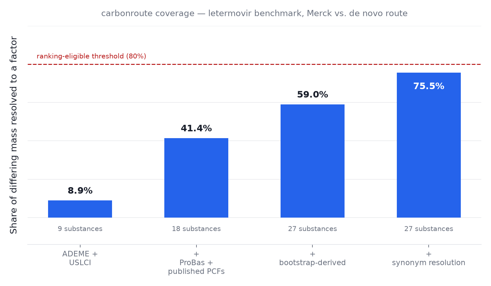
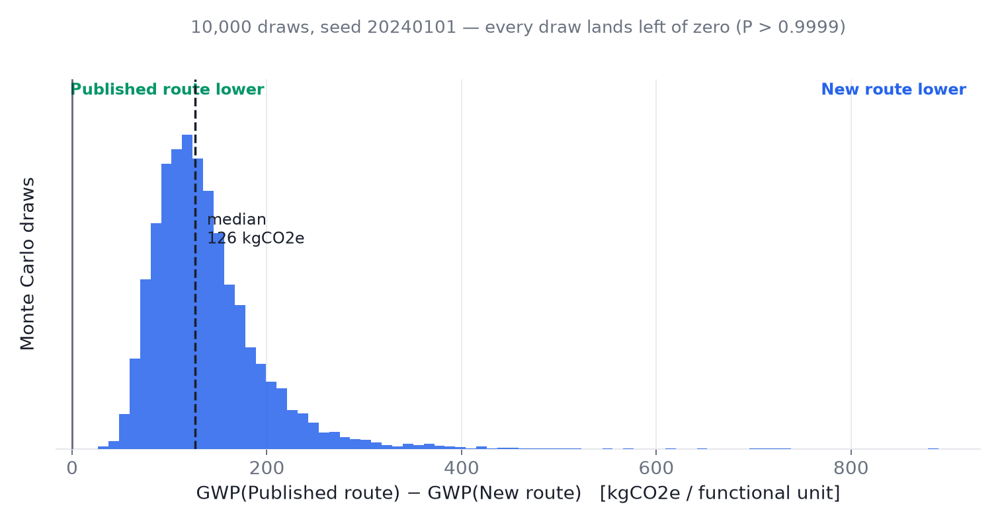
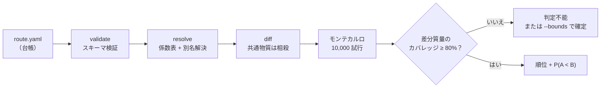
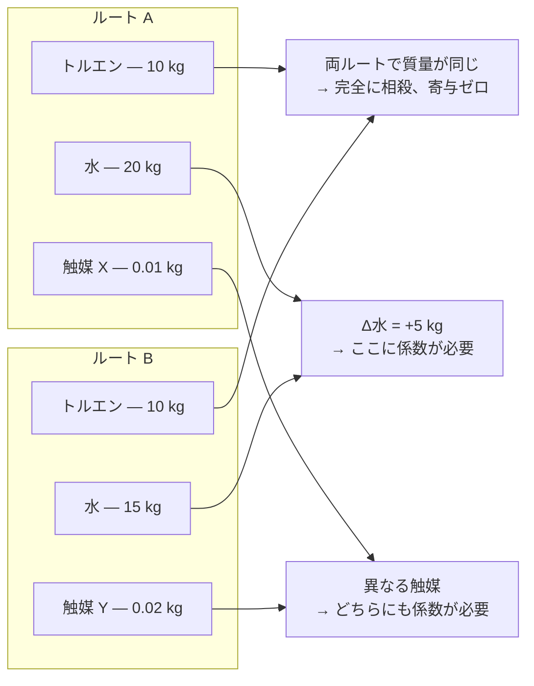

<!-- markdownlint-disable MD013 -->
<p align="right"><a href="README.md">English</a> | <strong>日本語</strong></p>

# carbonroute

**同じ製品を作る2つの方法のうち、どちらが低炭素か。そして、それはどれくらい確からしいか？**

`carbonroute` はこの問いに、1件ずつ丁寧に答えることもできれば、反応
データベース全体に対してまとめて答えることもできる。「この合成の絶対的な
カーボンフットプリントは何kgか」には決して答えない。それに答えるには、
両方のルートで使うすべての原料について背景データが必要になり、その大半は
無料では手に入らないからだ。必要なのは**2つのルートで違う部分**のデータ
だけでよい。共通する部分は差し引きで相殺されて消える。これなら必要な
データはずっと少なく、公開データだけで実際に解ける問題になる——しかも、
普通のLCAツールが手を出さない規模で。

> これは v0 であり、審査・認証ツールではなく、スクリーニング（一次選別）
> ツールである。出力は **ISO 14067 準拠のカーボンフットプリントではない**。
> 何かに使う前に、[「本ツールがやらないこと」](#本ツールがやらないこと)と
> [`docs/limitations.md`](docs/limitations.md) を読んでほしい。

```bash
pip install -e .
carbonroute compare route.yaml --a routeA --b routeB
```

---

## 背景：なぜ「酵素は本当に環境に良いのか」に誰も網羅的に答えてこなかったのか

世界中で環境意識が高まるなか、各国でカーボンニュートラル実現に向けた
取り組みが行われている。化合物製造領域においては、有機化学反応に対して
環境負荷が低い酵素反応を活用したバイオものづくりが着目されている。
酵素反応では一般に水系溶媒、常温、常圧で立体・位置・光学選択的な反応が
進行するため、エネルギーロスや廃棄物が少ないとされている。

環境負荷を定量化した数値が **LCA（ライフサイクルアセスメント）** であり、
原料の採取から製造・輸送・使用・廃棄に至る製品のライフサイクル全段階に
ついて、投入した資源とエネルギー、および排出した物質を積み上げ、環境
影響に換算して評価する手法と定義される（ISO 14040/14044）。このうち
温室効果ガスだけを切り出し、製品1単位あたりのCO₂換算排出量（kg-CO₂e）
として表したものがカーボンフットプリント（ISO 14067）である。

他方、酵素反応と従来の有機化学反応をLCAに基づいて定量的かつ網羅的に
検証した研究は乏しい。これは、**LCAが「絶対値を積み上げる」手法として
設計されていること**が原因である。1件のフットプリントを算出するには、
投入する全物質の背景排出係数——それ自体が別のLCAの成果物——が必要に
なる。その多くは有償の商用データベースに囲い込まれており、しかも酵素
反応側の主役である補酵素（UDP-グルコース、NADPH、S-アデノシル-L-
メチオニン、アセチルCoA）には、公開された cradle-to-gate の排出係数が
事実上ひとつも存在しない。結果として1件の比較に数日から数週間の一次
文献調査が必要になり、反応データベース規模の網羅は原理的に手が届か
なかった。**ボトルネックは計算能力ではなく、データ取得のコストである。**

本研究では、**「どちらが低炭素か」を答えるのに絶対値は要らない**という
考えに基づき、**2つのルートの差集合（delta set）だけを積算し、欠損した
係数は点推定で埋めずに上下界をもつ区間として扱う**というアプローチで、
**酵素反応と有機化学反応の相対的な炭素排出量、およびその判定が覆る臨界
条件**を計算するツールである carbonroute を開発した。同じ生成物を作る
2ルートを比べるとき、両方に共通する項目は差し引きで相殺されて消える。
消えるのは反応ごとに異なる基質と生成物——最も調査コストの高い部分——
であり、残るのは酵素側の補酵素と、化学側の保護基・活性化剤・塩基・溶媒
という、いずれも数十種類の閉じた語彙だけである。したがって必要な一次
調査量は、反応の件数ではなく語彙の大きさで頭打ちになる。

carbonroute は、**(1) 数値を捏造しない**——欠損データは区間として持ち
込み、区間演算で判定が確定しなければ「判定不能」とそのまま出力する、
**(1b) その答えが「どの数値でできているか」を示す**——由来の厳密さだけ
では言えないことで、本リポジトリは公表した結論を3回撤回して学んだ。毎回、
1つの項が差分を支配し、その値が測定ではなく仮定から来ていた。出荷中の
クラスでは**388件中388件の判定が、同一の1物質に半分以上を負っている**、
**(2) 出力が勝敗ではなく臨界値である**——「酵素法の勝ち」ではなく
「化学プラントが溶媒を何%回収した時点でその結論が覆るか」を返す、
**(3) クラス単位でスケールする**——1つの反応クラスについて実在する
公表済み化学手順を1本テンプレート化すれば、同じクラスに属する反応は
1件あたり算術演算1回で採点できる、という特徴を有し、**バイオものづくり
のテーマ選定**——限られた研究資源をどの酵素反応に投じるべきかという
判断——および**環境優位性の主張の検証**において有用な技術である。

実際にその有用性に基づき酵素反応と有機化学反応の環境負荷を網羅的に
比較し、どの酵素反応が環境保全寄与が大きいか、酵素反応収率や溶媒
リサイクル率を考慮した際の優位性はどちらにあるか、既存のバイオもの
づくり領域の環境負荷低減効果は全酵素反応のうちどの程度の順位か、
などを検証した。

## 検証の現在地：どこまで到達し、何がまだ嘘か

**数値を捏造しないという方針は、自分自身の進捗にも適用する。** 直前の
段落は本リポジトリの到達目標であり、いま完了しているのはその一部で
ある。3つの問いそれぞれについて、必要なものと現在地を以下に示す。

| 問い | 必要なもの | 現在地 |
|---|---|---|
| **Q1.** どの酵素反応が環境保全寄与が大きいか | 反応クラスを横断して比較可能な指標とランキング | **指標は完了、被覆は未達**。製品1 kgあたりの削減量（kg-CO₂e）で順位付けできるようになった。ただしクラスは依然1つ（Rhea全体の2.2%）なので、比較する相手がまだ無い |
| **Q2.** 酵素反応収率・溶媒リサイクル率を考慮したときの優位性 | 収率 × 回収率の2次元の臨界曲線 | **完了**。両軸を実装済み。結果は下記——酵素法にとって都合のよい答えではなかった |
| **Q3.** 既存のバイオものづくりの環境負荷低減効果は全体の何位か | 商業化済みプロセスとRhea反応の対応付け、および分位点 | **未着手** |

### Q2への回答：損益分岐フロンティア

この節がかつて記述していたバイアスは解消された。そして解消した結果、
**結論そのものが変わった。**

非対称性の中身はこうだった。出荷中のテンプレートの化学側の物質量は、
出典論文自身の実収率——グリコシル化62% × 脱保護85% = **通算52.7%**——を
通した値になっている。つまり化学ルートは「1 kgの製品を得るには2倍近く
仕込む必要がある」という罰則を正しく払っていた。一方、酵素側の補酵素は
純粋な化学量論、すなわち収率100%を暗黙に仮定して課金されており、
対応する罰則を一切払っていなかった。現在は酵素の転化率が明示的な変数と
なり、補酵素の請求額を除する。転化率が半分の反応は、製品1 kgあたり2倍の
補酵素を消費するからである。

この軸を掃引すると、判定の本当の境界——点ではなく曲線——が現れる。
下表の各行は、判定確定した388件すべてを異なる転化率で採点し直した結果
である：

| 酵素転化率 | 閾値の最小 | 中央値 | 最大 |
|---|---|---|---|
| 100% | 85.58% | 86.42% | 91.54% |
| 90% | 83.94% | 84.87% | 90.54% |
| 80% | 81.89% | 82.94% | 89.30% |
| 70% | 79.25% | 80.44% | 87.70% |
| 60% | 75.73% | 77.12% | 85.57% |
| 50% | 70.80% | 72.47% | 82.59% |
| 40% | 63.41% | 65.50% | 78.11% |
| 30% | 51.10% | 53.87% | 70.65% |

転化率50%の酵素は、このクラスの閾値中央値を約14ポイント押し下げる。
しかし、より鋭い発見はもう一方の軸にある。工業的な蒸留の溶媒回収率は
およそ90%であり、**その回収率のもとで依然として判定が確定しているのは
388件中わずか25件しかない。残る363件は、酵素がどれだけ優秀であろうと
判定を失う。** 生き残った25件も、判定を維持するには最小85.3%、中央値
93.3%、最悪100%という転化率を要求する。較正に使った反応
（RHEA:12560、β-アルブチン）自身も363件の側にある——その閾値85.87%は、
プラントの90%を下回るからだ。

したがってQ2への正直な回答はこうなる。**このクラスにおいて、現実的な
溶媒リサイクルを前提とすると、酵素法の優位性はほぼ存在しない。存在する
場合も、ほぼ定量的な転化率を要求する。** 手元で確かめるには：

```bash
carbonroute screen --template ... --bounds ... --assumptions-from ... \
  --enzymatic-yield 0.5 --frontier
```

### Q1の指標：クラス間で比較できるもの、できないもの

溶媒回収率の閾値は、そのテンプレートが偶々背負っている溶媒負荷に対して
測られている。だからグリコシル化クラスの86%とメチル化クラスの86%は同じ
主張ではなく、1つのリストに並べれば異なる物差しを比べることになる。
クラス間で通用するのは絶対量——**製品1 kgあたりの kg-CO₂e 削減量**——を、
どのクラスでも同じ操業点で読んだ値である。各行はこれを区間として保持
するようになった。評価点はベンチの0%ではなく、溶媒回収90%である。

区間に対する順位付けは全順序にはなり得ない。そこで `rank_by_advantage`
は**順位の範囲**を返す。ある反応が別の反応を上回るのは、自分の最悪値が
相手の最良値を上回るときだけである。区間の中点でソートして1位、2位、
3位と印字することは、本プロジェクトが他のあらゆる場面で拒否している
「精度の捏造」そのものになる。

出荷中のクラスに対して実行すると、これは化学ではなく**境界条件（bounds）
について**の事実を報告する。全反応の順位範囲が1–388で返ってくるからだ。
理由は、化学側の4物質に意図的に上限を置いていない（`high: null`——
根拠のない天井を発明することへの正直な拒否）ためである。化学側が上に
非有界なら酵素側の優位性も上に非有界になり、何も何かを上回れない。
レポートはその4物質を名指しするので、この欠落は「謎」ではなく「次に
埋めるべきデータ」になる。根拠のある上限を置けば、この順位付けは機能
し始める。

当面利用できるのは**保証下限**——主張された境界のどこであっても成立する
削減量——である。溶媒回収90%のもとで、下限が正になるのは**388件中25件**
だけだった。そしてこの下限順位は、スクリーニングが本来測定したかった
機構を再現している：上位10件はいずれも保護可能官能基を20〜34個持ち、
首位はN-グリカンの **+4.15 kg-CO₂e/kg** である。これは、この指標が閾値と
同じものを測っていることの検算になっている。

### ここから先の道筋

1. **脱溶媒に本気の化学テンプレートを作る**（フェアな勝負）。両ルートに
   努力ダイヤルが揃った——化学側は溶媒回収率、酵素側は補酵素再生率——
   `--fair-fight` は両者を同時に動かす。再生は無料ではない：何がターン
   オーバーを駆動するかを申告しないテンプレートは再生を主張できない。
   ただし**支払い方は1つではない**ので、テンプレートは「課金の形」を
   宣言する：`per_turnover`（毎サイクル消費される共基質。再生率を上げても
   下がらない）と `amortised`（一度買って `reuse_cycles` 回のバッチで使う。
   **固定化酵素とその担体**がこれで、償却回数こそ固定化が上げようとする
   数である）。出荷クラスはスクロースを `per_turnover` で宣言しているが、
   **固定化の項は未申告**——酵素の仕込み量・再利用回数・酵素生産の
   cradle-to-gate GWP の3つが、実際に読んだ文献から得られていないためで、
   これはテンプレート内に明記してある（酵素生産GWPと再利用回数は文献から
   取得済み、残るは「生成物1 molあたりの酵素仕込み量」1つ）。
   共基質の量は理論値ではなく**実際の仕込み量**（Liu et al. 2021, CC BY:
   生成物1 molあたりスクロース4.196 mol）に修正した。理論値は4.2倍の
   過小評価で、酵素側に有利に働いていた。**この修正で結果が変わった**：
   補正前は効率99%でも酵素が388件全勝していたが、実際の仕込み量では
   99%で**全388件が判定不能**になる。あの全勝は酵素への過少課金の産物
   だった。一方、論文が報告する実数値同士——UDP-グルコース240回転と
   工業標準の溶媒回収90%——で採点すると、**388件すべてが保証された削減
   量を持つ**。
   ただし依然として1つの数字が支配的である：テンプレートの酢酸エチル
   159 kg/mol という単離操作だ。回収率はこの数を割るだけで、
   **選び直すことはできない**。
   **溶媒の「回収」と「回避」は別のレバーである。** 脱溶媒に本気の酵素法
   を、無駄な手順の後始末をしているだけの化学法にぶつけるのは、見た目に
   反してフェアな勝負ではない。このクラスには、手順そのものが脱溶媒的な
   出典から作ったテンプレートが要る。
2. **選定規則を明示してクラスを増やす**（Q1の網羅性）。EC-3上位群——
   1.1.1（526件）、2.1.1（500件）、2.3.1（382件）——で累計1,808件、Rhea
   全体の9.7%、EC付与分の23.7%。各クラスに実在の公表手順が1本ずつ必要で、
   全クラスで同一の規則で選ばないと、クラス横断の順位は化学ではなく
   「各論文の著者がどれだけ本気だったか」を測ることになる。
3. **商業プロセスを位置づける**（Q3）。ヒトミルクオリゴ糖のフコシル化
   （RHEA:14257 ほか）、アントシアニン配糖化（RHEA:20093）、β-アルブチン
   （RHEA:12560）など、既に商業生産されている酵素反応をRhea IDに対応
   付け、上記の保証下限順位における分位点を報告する。

「網羅的」の上限も正直に述べておく。EC番号が付与されているのはRheaの
18,558件のうち7,635件（41.1%）であり、EC-3レベルの上位10群を全て
テンプレート化しても3,130件（16.9%）にしか届かない。本手法が目指すのは
データベース全体の悉皆調査ではなく、**「どの反応クラスに投資すべきか」を
決めるのに十分な被覆**である。

---

## 実在する酵素反応18,558件を、約1秒で。当てずっぽうはゼロ。

普通の比較LCAツールは、1組のルートについて1つの問いに答えるだけである。
なぜなら、たった1件の比較のための背景データをそろえるだけでも、丸1日
仕事になるからだ。`carbonroute screen` は同じ問い——酵素法か、化学合成法
か——を、キュレーション済みの反応データベース全体に対して一気に答える。
しかも、データベースの大きさそのものがボトルネックにならない速さで。

酵素反応データベース [Rhea](https://www.rhea-db.org/) にある、UDP-グル
コースまたはその立体異性体UDP-ガラクトースを消費する糖転移反応406件
すべてを、実在する公表済みの化学合成手順1つに対してスクリーニングした。
かかった時間は約1秒：

| 統計量 | 溶媒回収率の閾値 |
|---|---|
| 最小 | 85.58% |
| 中央値 | 86.42% |
| 最大 | 91.54% |

> この3つの数値は、酵素の転化率を100%と置いたときの**上限**である。
> 実際の転化率を織り込むと閾値はさらに下がり、工業標準の90%溶媒回収の
> もとでは388件中363件が判定そのものを失う。
> [「Q2への回答：損益分岐フロンティア」](#q2への回答損益分岐フロンティア)を参照。

「閾値」の意味を、具体的に説明する。化学ルートは大量の溶媒を使い捨てる
前提で計算しているので、まず酵素法より不利になる。しかし化学プラント側
が溶媒を回収してリサイクルすればするほど、化学ルートの排出量は下がって
いき、酵素法との差はだんだん縮まる。**閾値とは、化学プラントが溶媒を
何%回収した時点で、この差がちょうどゼロになるか**を、反応ごとに計算
した数字である。たとえば閾値が85.58%の反応なら、化学プラントが溶媒の
85.58%未満しか回収していない限り酵素法の方が低炭素だと確定的に言え、
85.58%を超えて回収するようになると、もう酵素法が有利だとは言い切れなく
なる。

これを見出しの数値にしたのは、「勝った反応の数」を見出しにすると誤解を
招くからだ。実際の工業的な蒸留による溶媒回収率は、普通90〜95%に達する。
つまり、406件の反応の閾値（85.58%〜91.54%）は、軒並みこの実プラント
水準を下回っている。言い換えると、**判定が確定した388件のうち、実際の
工場が普通に達成できる99%という回収率に耐えられるものは1件もなかった。**
だから正直な結論は「酵素が388回勝った」ではない。**「この反応クラスに
おいて、酵素法の環境優位性は確かに実在するが限定的であり、工業的な
標準的な溶媒リサイクルの前ではほぼ消えてしまう」**ということだ。これは
反証可能な主張であり、単なる宣伝文句ではない。

**「約1秒」が指しているものと、指していないもの。** これは、既に出来て
いるクラステンプレート1つに対して406件を採点する時間であり、純粋な
算術計算だけで済む。**このテンプレートを1本作ること自体の時間ではない。**
テンプレートの出発点は、実在する1件の、数量まで裏取りできる公表済み
化学手順であり、それを見つけて検証する作業は、`data/factors/` の
どの行を作るのにも要求しているのと同じ、実際に論文を読んで確かめる
作業である。ここは決して速くならないし、速いと主張したこともない。
「反応の件数」に対しては無料でスケールするが、「次の反応クラス」を
1つ追加するのは無料にはならない——ただし例外もある。406件のうち143件
を占めるUDP-ガラクトースは、新規の調査ゼロでこの同じクラスに追加できた。
UDP-グルコースの立体異性体（分子式も、付加する質量も同一）だからで、
これはRDKitで実際に検証済みであり、名前から類推しただけではない。どの
補酵素なら同じ手が使えるかを当てずっぽうではなく決める方法は、下の
「次に作るべきクラスを、頻度ではなくEC番号で選ぶ」で説明する。

このスクリーニングが本来測定したかった仕組みも、データのばらつきに
はっきり現れている。閾値は、**化学ルートが保護しなければならない基質
側の官能基の数が多いほど高くなる**——官能基が1個以下なら85.58%、34個
もある大きなオリゴ糖では91.54%だ。これは、分子構造の情報だけから
データベース規模で定量化された、酵素の位置選択性（狙った場所だけに
反応させる性質）にほかならない。

### なぜ18,558件が「解ける規模の問題」になるのか

近道をしているのではない。1組のルート比較（`compare`）を成立させて
いるのと同じ「相殺」の仕組みを、データベース全体に適用しているだけで
ある。2つのルートが同じ生成物を作るとき、両方に共通するものは全て
差分から消える。酵素法と化学合成法を比べる場合、消えるのはまさに、
調べるのに一番手間のかかる部分——反応ごとに違う基質と生成物——だ。
残るものは種類が少なく、何度も繰り返し登場する：

| 側 | 差分に残るもの |
|---|---|
| 酵素側 | **補酵素**——UDP-グルコース、NADPH、SAM、アセチルCoA など |
| 化学側 | **保護基・活性化剤・塩基・溶媒** |

これは予想ではなく、実際に数えて確かめた事実である。Rheaの18,558件の
反応には14,251種の物質が登場するが、**100件以上の反応に出てくるのは
わずか63種、1,000件以上はたった12種**しかない。そして上位30種だけで、
データベース全体の「反応×登場物質」の組み合わせの47.8%を占める。この
上位リストの中身は、生化学の研究者が暗記しているような補酵素のリスト
そのものだ。上位30種が取りこぼす残りは、まさに反応ごとに違う基質と
生成物——差分計算で相殺されて消える部分である。

したがって、排出係数をそろえる作業量は、この「よく出てくる物質」の
語彙の大きさ——数十種類——で頭打ちになり、反応の総数には比例しない。
必要な係数さえそろえば、あとは1反応あたり算術計算1回で済む。

ただし、「語彙が有限だ」ということは「1つの補酵素＝1つのきれいな反応
種類」を意味しない。UDP-グルコースがほぼ全てO-グリコシル化1種類だった
のは、たまたまそうだっただけで、代表例ではない。実は素の頻度で見ると
UDP-グルコースは上位20位にも入らない（263件）。本当に頻度が高いのは
CoA（1,649件）・ATP（1,384件）・NAD(P)(H)（1,200〜1,382件）などだが、
これらは1つの補酵素の中に、全く性質の違う反応が混在している。例えば
CoAは「基質にアセチル基を1個つける」反応と、脂肪酸合成のクライゼン
縮合のような別種の生合成反応の両方に使われる。補酵素が同じというだけ
では「同じ変換だ」とは言えない——これは分子構造から機械的に検証する
必要がある。

### 次に作るべきクラスを、頻度ではなくEC番号で選ぶ

だから「一番件数の多い補酵素から手をつける」は間違った方針だ。CoAや
SAMはUDP-グルコースより件数で勝るが、どちらも中身が雑多である。件数は
「母集団の大きさ」を測っているだけで、「均質さ」は測っていない。

**EC（Enzyme Commission）番号**がその代わりになる。これは「この酵素は
どんな変換をするか」を60年かけて整備してきた、生化学の専門分野そのもの
の分類体系だからだ。Rheaの反応をEC番号の上3桁（`2.4.1.218`ではなく
`2.4.1`）でまとめると252グループになる——化学的な意味を保ちつつ、
手に負える粒度だ。上位4グループについて、実際に「反応が基質に付加する
質量は本当にきれいに集まるのか」を検証した：

| ECグループ | 反応数 | 主な補酵素 | 質量差の集まり方 | カバー率 |
|---|---|---|---|---|
| 1.1.1（酸化還元酵素） | 526 | NAD(+)/NADP(+) | −2.0（水素2個が抜ける＝酸化） | 100% |
| 2.1.1（メチル基転移酵素） | 500 | SAM | +14, +15, +28, +42（1〜3個のメチル化） | 99.5% |
| 2.3.1（アシル基転移酵素） | 382 | アセチルCoA | +41, +42（アセチル化） | 99.3% |
| 2.4.1（糖転移酵素） | 400 | UDP-グルコース | +162, +163, +324（糖転移） | 100% |

どのグループも、2〜4個の狭いビンにきれいに収まる——同梱クラスの
`expected_mass_delta` チェックがすでに使っているのと同じ「特徴的な質量
のパターン」が、独立に3回再現されたことになる。ECグループで絞り込む
ことは「補酵素を共有している」を「補酵素も変換の種類も共有している」
に変える操作だ。CoA全体は雑多だが、CoAをEC 2.3.1かつ主要な参加物質
（アセチルCoA）に絞ると99.3%が2つのビンに収まる。これが、UDP-ガラク
トースを「検証さえすれば追加できる」と判断できた根拠であり、今回の
1クラスだけでなく「次に何を作るべきか」への再現可能な答えでもある。
ただし、これは「実在する化学手順を見つける」作業の代わりにはならない
——質量差の均質性は、チェック機構が正しく働くことを裏付けるだけで、
テンプレートの中身（実際の合成手順）がすでにあることを意味しない。
それでも、その最初の一歩がもう当てずっぽうではなくなった。

実際、同梱のUDP-グルコース・UDP-ガラクトースのクラスでも、この検証に
よって「補酵素は消費するが実は別の変換」の反応が9件見つかり、正しく
除外されている（補酵素自身の加水分解、糖ヌクレオチド交換、脂質担体
への糖-1-リン酸転移、補酵素自体の酸化など。実装の詳細は
[`docs/screening.md`](docs/screening.md#picking-the-next-class-ec-number-not-raw-frequency)）。

### これが絵空事ではない証拠：較正（キャリブレーション）

スクリーニングは、各酵素反応を**クラステンプレート**——実在する1件の
公表済み化学手順を、そのクラスに属する全ての基質に当てはめたもの——と
組み合わせて比較する。この「1つの手順を他の基質にも当てはめる」という
外挿こそが、この手法の中心的な仮定だ。だから、スクリーニングの出力は
「本物の `compare` に時間をかける価値がある反応の、順位付きショート
リスト」であって、個々の反応についての最終判定ではない。

スクリーニングしたクラスの中の1件、RHEA:12560（ヒドロキノン +
UDP-α-D-グルコース → β-アルブチン）は、
[`examples/case-studies/beta-arbutin-chemical-vs-enzymatic/`](examples/case-studies/beta-arbutin-chemical-vs-enzymatic/)
で、全ての出典を1つ1つ確認しながら独立に手作業構築した事例でもある。
スクリーニングの結果は、この手作業版の生成物質量・基質・補酵素の投入
量・判定の方向を完全に再現し、テストがそれを固定している。この一致が
なければ、残り387件の結果は自分自身のテンプレートをなぞって報告して
いるだけになる。一致していることで、テンプレートが実在の、独立に
出典を確認した化学と照らし合わされた、ということになる。

手法の詳細は [`docs/screening.md`](docs/screening.md) に、実測した
補酵素の語彙は [`data/rhea/README.md`](data/rhea/README.md) にある。

## 土台となる能力：これまで試した中で最もデータが乏しい事例でも、判定は確定する

ここまでの結果はすべて、「公開データが薄くても、1件の比較を正しく判定
できる」という能力の上に成り立っている。その能力そのものを、単独で、
これまで本プロジェクトが試した中で**もっともデータの少なかった**事例で
見せる。

[Grimaldi et al., *ACS Sustainable Chem. Eng.*
**2021**](https://doi.org/10.1021/acssuschemeng.1c02309) は、2つの
イブプロフェン合成経路を比較した論文である。1つはフローケミストリー法
（`bogdan`）、もう1つはその最後の1段階を酵素反応に置き換えた変種
（`enzymatic`）だ。公開されている係数だけでは、差分質量のわずか
**52.9%**しか解決できない。9つの物質が未解決のまま残り、普通ならここで
自動的に `indeterminate`（判定不能）になる。

しかし、2つのルートの順位を決めるのは、どちらか一方の値を正確に測る
より簡単な問題である。欠けている係数が実際に**いくらか**を知る必要は
なく、それが順位をひっくり返すほど大きいかどうかさえ分かれば十分だ。
`carbonroute compare --bounds bounds.yaml` は、未解決の物質それぞれに
根拠のある区間——質量収支からの計算、既に手元にある似た物質の係数、
互いに食い違う2つの公表値をそのまま下限・上限として使う、など——を
与え、「ルートAの排出量 − ルートBの排出量」の符号が、その区間の組み
合わせが取りうる**あらゆる値**で変わらないかどうかを調べる：

> **Decided: `bogdan` is lower than `enzymatic` everywhere in the asserted bounds.**
> （判定確定：主張した境界の中のどの値を取っても、`bogdan` の方が低い）

| material（物質） | delta_mass kg/FU（差分質量） | needs to be（結論を変える条件） | asserted bound（設定した境界） | clears it（境界内で条件を満たすか） |
|---|---|---|---|---|
| 1-butyl-3-methylimidazolium hexafluorophosphate（イオン液体） | -8.412 | 1.715 kgCO2e/kgを超える必要がある | [3.5, 上限なし] | yes（満たす） |
| trimethyl orthoformate | -1.666 | どんな値でも結論は変わらない | [0.27, 上限なし] | yes |
| phosphate buffer solution, 0.05 M（リン酸緩衝液） | -1.616 | どんな値でも結論は変わらない | [0.55, 2] | yes |
| *…残り5物質、すべて同様* | | *どんな値でも結論は変わらない* | | *yes* |

未解決の9物質のうち7つは、境界内のどんな値を取っても結果を変えられ
ない。比較全体は、たった1つのイオン液体についての1本の不等式に帰着
する——「その係数は1.715 kgCO2e/kgを超えるかどうか」だけが問題になる。
最も近い類縁物質について公表されている2つの推定値は互いに8倍も食い
違っているが、それでも両方ともこの閾値を2.0倍・15.9倍という余裕で
クリアする。2つの推定値は「いくつか」では一致しないが、「どちらが
大きいか」では完全に一致する。それが、順位を決めるのに必要な全てだ。

このイオン液体は反応溶媒であり、バッチ間で回収・再利用できる。その
ため結果は回収率に条件付けられる：51.0%までは上の結論が成り立つ。
引用元の論文自身も、回収率50%と100%の2つのシナリオで結果を報告して
おり、同じ方向の結論に達している。本プロジェクトの計算は、データの
ごく一部だけを使い、論文が依拠している商用データベースを一切使わず
に、論文と同じ結論にたどり着いたことになる。

境界の値がそのまま係数として使われることは一切ない。モンテカルロ・
シミュレーションに入ることも、報告される合計値に足し込まれることも、
カバレッジの割合を変えることもない。手法の詳細は
[`docs/bounds.md`](docs/bounds.md)、各境界値とその根拠は
[`examples/case-studies/ibuprofen-bogdan-vs-enzymatic/`](examples/case-studies/ibuprofen-bogdan-vs-enzymatic/)
にある。

## そして、本当にデータが足りないときは、正直にそう言う

信頼できるツールであるためのもう半分は、証拠が十分でないときに答える
のを拒むことだ。上の事例では判定を出せたが、当てずっぽうを言えば
間違えていたはずの場面もある。ここでは、別の実在論文で、まさにそれを
正しく実行している様子を見せる。

[Sorgenfrei et al., *J. Am. Chem. Soc.* **2025**, 147, 40944](https://doi.org/10.1021/jacs.5c14470)
（オープンアクセス）は、抗ウイルス薬**レテルモビル**への実在する2つの
ルートを比較した論文である。1つはMerckが実際に使う工業ルート、もう
1つは著者らが新たに設計したルート。両方の排出量を、有償で再配布
できない商用データベース**ecoinvent**を使って計算している。論文が
報告した数値はMerckルートが382 kgCO₂e/kg、新ルートが369 kgCO₂e/kg——
新ルートの方が約3%低いという結果だった。

`carbonroute` はecoinventの中身を見ることができず、見えるのは公開
ライセンスのデータだけだ。これは、この種の計算に取り組むほとんどの人が
実際に置かれている状況でもある。同じ2つのルートに対して、使える公開
データを少しずつ増やしていくと何が起きるか、見てほしい：

<p align="center">
  
</p>

最初の段階では、本ツールは**もし判定を出していたら間違えていたはず**
だった。差分質量のわずか8.9%しか公開データで解決できておらず、見えて
いる数値は「Merckルートの方が低い」という、論文の結論とは逆の方向に
傾いていた。`carbonroute` はこの状態で判定を出すことを拒んだ：

```
## Conclusion

**The comparison is undecided**, because only 8.9% of the differing mass
(2 of 43 materials) resolved to a factor, below the declared minimum of 80%.
No ranking is reported.
```

（訳：この比較は判定不能である。差分質量のうち、係数が解決できたのは
わずか8.9%（43物質中2物質）であり、既定の最低基準である80%に届いて
いないため。順位は報告しない。）

そこから実在する引用可能な公開データを追加し、さらに、どのデータ
ベースにも載っていない化学物質については、公表された製造プロセスの
データから係数を自前で導出する仕組み
（[`docs/bootstrap.md`](docs/bootstrap.md) 参照）も使った。その結果、
カバレッジは**75.5%**まで上がり、証拠が指し示す方向も論文の結論と一致
する側へ反転した。それでも判定は依然として `indeterminate`（判定
不能）のままである。75.5%は、ツールが順位を確定させるために要求する
80%にまだ届いていないからだ：

```
Resolved part of the difference: 50.28 kgCO2e/FU.
Unresolved differing mass: -4.205 kg/FU (signed).

The ranking reverses if the 4.205 kg/FU of unresolved material averages
more than 11.96 kgCO2e/kg. Compare that against the factors you do have
before treating the ranking as settled.
```

（訳：差分のうち解決できた部分は50.28 kgCO2e/機能単位。未解決の差分
質量は-4.205 kg/機能単位（符号付き）。この未解決の4.205 kgが平均して
11.96 kgCO2e/kgを超えると、順位は逆転する。この順位を確定済みとして
扱う前に、手元にある他の係数と比べて妥当か確認してほしい。）

つまりこれは、「残り24.5%の未解決分がどれくらい外れていたら結論が
ひっくり返るか」を、ツールが正確な数字で教えてくれているということだ。
根拠のない確信ではなく、自分の直感と実際に照らし合わせられる数字を
渡してくれる。全体像は [`benchmarks/README.md`](benchmarks/README.md)
にある。

3件目の実在論文——ZIF-8金属有機構造体のルート比較（カバレッジ6.8%）
——も、同じ理由で同じ壁にぶつかった。特殊な溶媒についての公開係数
データは薄く、ツールは当てずっぽうで埋めるよりも判定を拒む方を選ぶ。
詳細は [`examples/case-studies/`](examples/case-studies/) にある。
根拠データがAI・機械学習によるモデル推定だったために調査の末に却下
した論文の記録も、そこに含めてある。

## 30秒で自分の手元で動かしてみる

同じ架空の製品への、2つの架空のルート。このリポジトリに入っている
ものだけで、今すぐ実行できる：

```bash
carbonroute compare examples/route.yaml \
  --a legacy --b denovo \
  --factors examples/factors_illustrative.csv
```

```
## Conclusion

**New route is very likely lower** than Published route (P > 0.9999).

Delta (Published route - New route): median 126.4 kgCO2e/FU,
90% interval [70.94, 237.3], 10000 draws, seed 20240101.
```

`carbonroute` は内部でモンテカルロ法というシミュレーションを走らせて
いる。1回の試行は、「実際の排出係数がありうる範囲のどこかにある」と
いう仮定のもとで、今回はどちらのルートが低炭素になるかを1回だけ調べる
計算である。それを1万回繰り返し、勝った回数の割合を確率として報告
する。上の例では1万回すべてが「新ルートの方が低い」という結果に
なった：

<p align="center">
  
</p>

ここにあるのは実データではない。`examples/factors_illustrative.csv` の
値は、誰が見ても架空だと分かるキリのいい数字だけを使っており、レポート
本文でもその旨が大きな警告として表示される。これは、自分でまだ実データ
を1つも用意していない段階でも、パイプライン全体の動きを一通り見られる
ようにするためのものである。

## 仕組み



上で紹介したどの結果も、同じ **diff（差分）** の工程の上に成り立って
いる。同じ製品を作る2つのルートは、実はかなりの部分を共有していること
が多い。同じ溶媒、同じ試薬、時には同じ触媒。そこには出典付きの排出
係数はまったく要らない。引き算をすれば両辺で打ち消し合って消えるから
だ：



（この発想のもとになっているのは [DeltaLCA](https://arxiv.org/abs/2311.09611)
という研究である。本ツールはそれを、電子機器ではなく化学合成のルート
に応用している。そして `screen` を通じて、1組のルート比較だけでなく、
反応クラス全体にも応用している。）

人間が判断すべき事柄——想定する電力系統、溶媒の回収率、GWPの計算に
使う時間幅、どこからを統計的な「引き分け」とみなすか——はすべて、
台帳ファイルの `assumptions:` という一箇所にまとめて書く。それより
先の計算はすべて機械的に決まる。同じ台帳と同じ係数表を使えば、小数点
以下まで常に同じ数値が出る。

## インストール

Python 3.11 以上が必要である。

```bash
pip install -e .
```

依存パッケージは `pydantic`、`numpy`、`PyYAML`、`click` のみに絞って
いる。RDKit はオプション（`pip install -e ".[chem]"`）であり、物質同定
の補助と `carbonroute screen` の構造由来の計算（分子量、保護すべき
官能基の数）にのみ使う。`validate`・`resolve`・`coverage`・`compare`・
`bootstrap`・`lock` の実行には一切不要である。

## 台帳（ledger）

ルート台帳は1つのYAMLファイルである。正式な形式は
`src/carbonroute/schema.py`（pydanticモデル）で定義されており、外部
検証用に [`schemas/route-ledger.schema.json`](schemas/route-ledger.schema.json)
にも同じ内容が反映されている。

```yaml
schema_version: "0.1"

assumptions:
  functional_unit: {mass_kg: 1.0, basis: product}
  boundary: cradle-to-gate
  grid_factor:
    id: JP-2024
    value_kgCO2e_per_kWh: 0.43
    source: "Analyst-declared placeholder; replace with the grid factor you can cite."
    uncertainty_class: assumption
  gwp_method: {name: IPCC-AR6, horizon_years: 100, feedbacks: false}
  solvent_recovery_default: 0.0
  waste_treatment: excluded
  monte_carlo: {iterations: 10000, seed: 20240101}
  indeterminate_band: {low: 0.4, high: 0.6}

routes:
  legacy:
    label: "Published route"
    steps:
      - id: 1
        yield: 0.82
        inputs:
          - {name: toluene, cas: "108-88-3", mass_kg: 12.0, role: solvent}
          - {name: "substrate A", cas: null, mass_kg: 1.0, role: reactant}
        electricity_kWh: 30.0
  denovo:
    label: "New route"
    steps: [...]
```

知っておくべき点は次の通りである：

- 各投入量の `mass_kg` は、その工程で実際に投入した質量をそのまま
  記入する。機能単位（比較の基準となる量）への換算——下流の全工程の
  累積収率で割り戻す計算（仕様書7.1節）——はツールが自動で行うので、
  自分で計算する必要はない。
- `role`（役割）は `solvent`（溶媒）、`reactant`（反応物）、
  `reagent`（試薬）、`catalyst`（触媒）、`auxiliary`（補助剤）の
  いずれかを指定する。役割ごとの内訳表示に使われる。
- `cas`（CAS登録番号）は、分かる限り必ず記入すべきである。係数表との
  照合や、異なるルート・工程に登場する同一物質を結びつけるときの主
  キーになる。CAS番号がない物質は、正規化した名前をキーとして代用
  するが、これは照合の精度が落ちる弱い一致であり、その旨がレポートに
  明記される。
- `assumptions.solvent_recovery_default`（と、物質ごとに個別指定
  できる `solvent_recovery`）は、投入した溶媒のうちどれだけを「新規
  投入」ではなく「回収して補給しただけ」として扱うかを決める（仕様書
  7.2節）。既定値は0、つまり何も指定しなければ回収は一切ないものと
  して計算する。
- `routes`（ルート）は、必ず一本道の工程列として記述しなければ
  ならない。v0では、2つの合成経路が途中で1つに合流するルートを台帳で
  表現する方法がない。

前提条件（assumptions）を書ける場所は、この完全なルート台帳の中だけ
である。それ以外に設定を書く手段は存在しない。

## コマンド

| コマンド | 内容 |
| --- | --- |
| `carbonroute validate route.yaml` | スキーマ検証のみを行う。係数の参照も排出量計算も一切行わない。 |
| `carbonroute resolve route.yaml [--show-missing]` | 台帳に出てくる全物質を係数表で検索し、一致した物質・しなかった物質を報告する。排出量計算はまだ行わない。 |
| `carbonroute coverage route.yaml --a A --b B` | ルートAとBの差分質量のうち、読み込んだ係数表でどこまで解決できるかを、件数と質量の両方で報告する。未解決分が残る場合、終了コード3を返す。 |
| `carbonroute compare route.yaml --a A --b B [--bounds B.yaml] -o report.md` | 差分抽出・モンテカルロ順位判定・逆転閾値の探索を含む本比較を実行する。`--bounds` を指定すると、係数だけではカバレッジ80%に届かない場合でも、境界から判定を確定できるか調べる。 |
| `carbonroute bootstrap --processes data/processes -o out.csv` | どの公開データベースにも載っていない物質について、製造プロセスのレシピから係数を導出する。詳細は [`docs/bootstrap.md`](docs/bootstrap.md)。 |
| `carbonroute screen --template CLASS.yaml --bounds B.yaml` | 反応データベース全体を、1つの化学ルートのテンプレートに対してスクリーニングし、反応ごとの溶媒回収率の閾値を報告する。詳細は [`docs/screening.md`](docs/screening.md)。 |
| `carbonroute lock route.yaml -o route.lock.json` | 使用した係数表のバージョン、解決した全ての値とその出所、乱数シードを固定し、第三者が同じ結果を再現できるようにする。 |

`resolve`・`coverage`・`compare`・`lock`・`bootstrap` は、いずれも
`--factors PATH`（繰り返し指定可能。既定では `data/factors/` 配下の
全CSVを使う）と `--synonyms PATH`（既定では `data/synonyms/` 配下の
全CSVを使う。台帳で使う物質名を識別子に対応付けるための表であり、
詳細は [`docs/data.md`](docs/data.md)）を受け付ける。`compare` と
`lock` はさらに `--uncertainty PATH`（既定では同梱の
`config/uncertainty.yaml`）を受け付ける。`resolve` は不確実性モデルに
一切触れないコマンドなので、この対象外である。`compare` はこれに
加えて `--iterations`、`--seed`、`--no-thresholds` を受け付ける。
`validate` にはオプションが一切ない。`resolve` と `compare` には、
将来ネットワーク経由で係数を取得するための `--fetch` フラグが用意
されているが、v0では常にエラーで終了する。**ネットワークアクセスは
既定で無効になっており、本ツールのコードにはそもそもソケットを開く
経路が一切存在しない。** どのコマンドについても、唯一許されている
副作用は `-o` で指定したファイルへの書き込みだけであり、`-o` を指定
しなければ標準出力に結果を表示する。

### 一連の実行例

```bash
# 1. 構造チェックのみを行う。
carbonroute validate examples/route.yaml

# 2. 例示用の係数表に対して何が解決できるか、
#    そしてこの表しかなかった場合に何が足りないかを確認する。
carbonroute resolve examples/route.yaml \
  --factors examples/factors_illustrative.csv \
  --show-missing

# 3. 2つのルートを比較し、Markdownレポートを出力する。
carbonroute compare examples/route.yaml \
  --a legacy --b denovo \
  --factors examples/factors_illustrative.csv \
  -o report.md

# 4. 使用した係数の値・バージョン・乱数シードを固定し、
#    第三者が同じ結果を再現できるようにする。
carbonroute lock examples/route.yaml \
  --factors examples/factors_illustrative.csv \
  -o route.lock.json
```

`report.md` の冒頭には、順に (1) この結果がISO 14067準拠の算定では
ないという注記、(2) 適用した前提条件の全文、(3) 係数表のバージョンと
SHA-256ハッシュ、(4) 出所別の解決内訳が並び、その後に結論が続く。
`examples/factors_illustrative.csv` の各行はすべて `ILLUSTRATIVE`
（架空データ）と印付けされているため、これを使ったレポートには
「この結論はパイプラインの動作確認以外には使えない」という大きな
警告も表示される。結論そのものは、常に順位と確率として提示される
——`P(GWP_legacy < GWP_denovo)`（確率）、`"A<B"` / `"B<A"` /
`"indeterminate"`（判定）、差分の中央値と90%区間——単一の絶対値が
見出しとして示されることは決してない。

## 本ツールがやらないこと

このリストは実装の見落としではなく、意図的な線引きである。今後すぐに
縮まる見込みもない（`docs/spec-ja.md` 5.2節と `docs/limitations.md` を
参照）。v0では、以下のことは行わない：

- **複数の経路が合流するルートの扱い。** サポートするのは一本道の工程列
  だけである。2つの合成分岐が1つに合流するようなルートは、台帳の
  スキーマではそもそも表現できない。
- **実験室規模から工業規模への外挿を自動で行うこと。** 台帳に書かれた
  投入量は、そのままそのとおりに扱われる。ベンチスケールの反応と
  工業プロセスとの間で、溶媒の使用量や加熱効率、収率がどう変わるかを
  自動でモデル化する機能はない。`--bounds` や `solvent_recovery` を
  使えば、その感応度を自分で明示的に調べられるが、何かを勝手に仮定
  することはない。
- **使用段階・廃棄段階のモデル化。** 計算対象の範囲（システム境界）は
  cradle-to-gate（原料採取から工場出荷まで）に固定されている。製品が
  工場から出た後のことは、一切スコープの外である。
- **気候変動以外の環境影響の網羅。** 出力される数値はGWP（地球温暖化
  係数、単位はkg CO2e）だけである。水使用量、毒性、土地利用といった
  ISO 14044が定めるその他の影響領域は対象外である。
- **計算のどこかで言語モデルを使うこと。** どの係数値も、どの解決の
  判断も、レポート中のどの数値も、言語モデルによって生成されたり
  調整されたりすることは一切ない。これは、汎用の大規模言語モデルが
  LCA関連のタスクで測定された信頼性の低さに対する、意図的な対応
  である（arXiv:2510.19886という研究は、11個のモデルに22種類のLCA
  関連タスクを行わせたところ、回答の37%に不正確または誤解を招く
  内容が含まれ、一部のモデルでは架空の引用をでっち上げる割合が最大
  40%に達したと報告している）。
- **逆合成によるルートの自動生成。** `carbonroute` は、与えられた
  ルートどうし、またはキュレーション済みデータベースが既に記録して
  いる反応どうしを比較するだけである。新しい合成経路の候補を自ら
  提案したり、探索したりすることはない。

そして、このリストとは別にもう1点。**本ツールの出力はISO 14067準拠の
カーボンフットプリントではない。** これは、どのルートを本格的な評価に
かけるべきかを判断するための、スクリーニング（一次選別）用の比較で
あり、本格的な評価そのものの代わりにはならない。この点は仕様書9節の
要求どおり、すべてのレポートに明示される。

## `data/factors/` の中身

`data/factors/` には、実際の排出係数データが入っている。そのすべてが
`scripts/` 内のスクリプトによって、公開ライセンスのソースから取得
されたものであり、同じスクリプトを再実行すれば表を再生成できる。表の
各行には、出典データセット名と該当レコード、配布ライセンス、取得日、
そして出典元が不確実性の情報を公表している場合はその数値までが記録
されている。

本稿執筆時点で、**27物質**、5つの出典から成る。ADEMEのBase Carbone
（フランスのオープンライセンス）、US LCI Database（米国政府作成物）、
ProBas/GEMIS（ドイツ環境庁が無償公開しているデータ）、生産者や業界
団体が直接公表した値（PlasticsEuropeのエコプロファイル、Nobianの
EPD）、そして `carbonroute bootstrap` 自身が導出した値である。この
最後の仕組みは、どのデータベースにも載っていない化学物質について、
出典付きの製造プロセスのレシピから係数を導き出すというもので
（2-MeTHF、酢酸エチル、酢酸イソプロピル、アセトン、DMF、MTBE、
トリエチルアミンなどに適用済み）、詳細は
[`docs/bootstrap.md`](docs/bootstrap.md) を参照してほしい。

複数の物質については、独立した2つ以上の公開ソースから値が得られて
おり、それらが必ずしも一致するわけではない。たとえば塩酸は、ある
ソースでは1.199 kgCO2e/kg、別のソースでは1.700 kgCO2e/kgとなって
いる。レポートには、実際に使われた全ての値が表示される。同じ物質でも
公開データにこれだけのばらつきがあるという事実は、平均を取って
うやむやにしてしまうのではなく、知っておく価値のある情報としてそのまま
扱っている。

**この27物質という数は、本ツールが判定を出せる上限を意味しない。**
`--bounds` や `screen` の補酵素語彙アプローチが存在するのは、まさに
これだけ小さいカバレッジでも実際の比較を決着させられることを、上で
示した通りだ。`carbonroute coverage` を使えば、係数だけに頼った自分の
比較が80%の基準まであとどれくらい足りないかが正確に分かる。欠落は
黙って省かれるのではなく、目の前の具体的な数字として示される。新しい
ソースを追加したい場合は、取り込み用のスクリプトをもう1本書けばよい。
書き方は [`docs/data.md`](docs/data.md) に、これまでに調査済みの
ソースとその採否の理由は
[`docs/sources-investigated.md`](docs/sources-investigated.md) に
まとめてある。誰がこの種のデータを持っていて、なぜその大半が本
プロジェクトの再配布できない商用データベースの中にあるのかは
[`docs/what-others-do.md`](docs/what-others-do.md) にまとめて
あり、もし自分がライセンスを持っている場合に `carbonroute` へどう
組み込めばよいかもそこに書いてある。

ここにある値は、どれ一つとして推定・補間・記憶からの想起によるもの
ではない。これは「公開データのみを使い、何も創作しない」という原則
（仕様書2節・13節）から必然的に導かれることである。もっともらしく
見えるが誰も検証できない数字を並べた表は、本ツールの存在意義そのもの
を損なってしまう。

`examples/factors_illustrative.csv` は、パイプラインを最初から最後
まで一通り動かせるようにするためだけに存在するファイルである。中の
値はすべて、誰が見ても架空だと分かるキリのいい数字であり、各行の
`source` 列は必ず `ILLUSTRATIVE`（架空データ）で始まる。これを使った
レポートには、その旨が必ず大きく表示される。引用してはならず、上記の
コマンドの動作確認以外の用途で使ってはならない。

## ライブAPIなしで全てを再現する

`carbonroute` 本体は、実行時に一切ネットワークへアクセスしない。これは
単なる説明文ではなく、インポートグラフ（モジュール間の依存関係）を
解析するテストによって、実際に強制されている。

一方、`data/factors/` と `data/rhea/` の中身を「構築した」スクリプト
群は、かつてはネットワークへのアクセスが必要だった。ADEME・PubChem・
ProBas・Federal LCA Commons・Rheaという5つのAPIは、いずれも本
プロジェクトの管理下にはない外部サービスである。そこで、各取り込み
スクリプトには今 `--offline` フラグが用意されており、ネットワークに
一切触れることなく、`data/raw/` 配下に保存された永続的なスナップ
ショット（取得結果の控え）から再生できるようになっている。どの
スナップショットがどのソースをカバーしているか、そして唯一残って
いる未解決の穴について知りたい場合は、
[`docs/reproducibility.md`](docs/reproducibility.md) を参照して
ほしい。

レテルモビルのベンチマークで使った実データそのもの——小さく、CC BY
ライセンスであることを確認済みのExcelワークブック——も、同じ理由で
[`benchmarks/letermovir/source-material/`](benchmarks/letermovir/source-material/)
にコミットしてある。`scripts/extract_letermovir_ledger.py --offline`
を引数なしで実行するだけで、このリポジトリに既に入っているファイル
だけを使って、`benchmarks/letermovir/ledger.yaml` をバイト単位で
完全に再現できる。

## ベンチマーク

2種類の試験集合があり、どちらも「合格の条件」を実装より先に書いて
から作られている（詳細は [`benchmarks/README.md`](benchmarks/README.md)）。

**B1（解析的ケース）** は、手計算でも検算できるほど小さな例である。
機能単位への換算、溶媒の補給量計算、両ルートに共通する物質の厳密な
相殺、そして同じ乱数シードから毎回ビット単位で同じ結果が出る再現性を
確認する内容になっている。

**B2（レテルモビル比較）** は、上で紹介したものそのものである。計算
コードより先にベンチマークを書いておくと、後から書いたのでは見つけ
にくい問題を見つけられる。実際、このベンチマークが作られる前は、
未解決の物質は黙って「ゼロ」として扱われており、差分質量のわずか
8.9%しか解決できていない段階でも、論文が公表した順位とは逆の順位に
対して「P > 0.9999」（99.99%以上確実）という判定を出してしまって
いた。上で紹介したカバレッジの下限チェックと逆転閾値の計算は、どちら
も、このベンチマークが先に実行されて失敗を検出したからこそ、後から
実装されたものである。

## さらに読む

- [`docs/screening.md`](docs/screening.md) — 反応データベース全体を
  スクリーニングする方法と、それが思ったより低コストで済む理由。
- [`docs/research-brief.md`](docs/research-brief.md) — 本リポジトリが
  「実際に読んだ文献から」まだ得られていない4つの数値と、それを埋める
  ための deep research 用プロンプト。
- [`docs/bounds.md`](docs/bounds.md) — 係数そのものが欠けている場合
  に、値ではなく境界（区間）だけから順位を確定させる方法。
- [`docs/data.md`](docs/data.md) — 係数表の形式と、引用可能な表の
  作り方。
- [`docs/bootstrap.md`](docs/bootstrap.md) — どのデータベースにも
  ない物質について、製造プロセスのレシピから係数を導出する仕組み。
- [`docs/uncertainty.md`](docs/uncertainty.md) — モンテカルロモデルの
  仕組みと、そのパラメータがどこまで検証済みか。
- [`docs/convergence.md`](docs/convergence.md) — モンテカルロの試行
  回数が十分だと言えるための手順、そしてまだ確認できていないこと。
- [`docs/limitations.md`](docs/limitations.md) — 本ツールに何が
  期待でき、何が期待できないか。
- [`docs/reproducibility.md`](docs/reproducibility.md) — 非APIルート：
  ライブネットワークなしで、全ての係数表を再現する方法。
- [`docs/what-others-do.md`](docs/what-others-do.md) — 業界のLCA
  ツールが代わりに何をしているか、そしてライセンス済みの商用
  データベースを本ツールに接続する方法。
- [`docs/spec-ja.md`](docs/spec-ja.md) — 完全な設計仕様書（日本語）。
  上記すべての設計判断の典拠。
- [`docs/internal-api.md`](docs/internal-api.md) — コントリビューター
  向けの、モジュール単位でのインターフェース説明。

## ライセンス

Apache License 2.0。詳細は [`LICENSE`](LICENSE) を参照。コードと
データは別々のライセンス体系のもとにある。`src/` 配下のコードは
Apache-2.0。`data/factors/` に追加する係数表は、行ごとに記録された
出典元のライセンスをそれぞれ継承する（詳細は `docs/data.md` を参照）。
