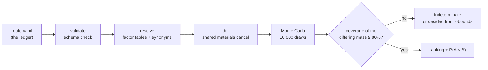
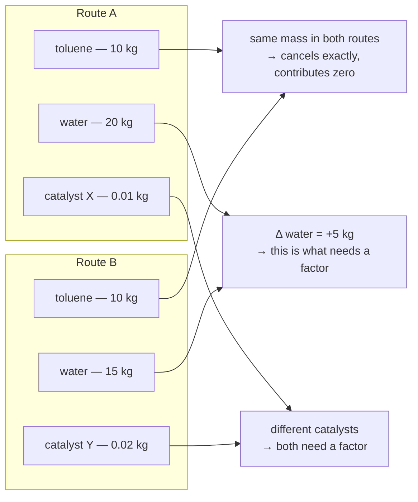

<!-- markdownlint-disable MD013 -->
<p align="right"><strong>English</strong> | <a href="README.ja.md">日本語</a></p>

# carbonroute

**Which of these two ways to make the same product has the lower carbon footprint — and how sure are we?**

`carbonroute` answers that question for one comparison at a time, or for an
entire reaction database at once. It never tells you the absolute carbon
footprint of a synthesis — that needs background data for every single
input, most of which nobody can get for free. It only needs data for
what's *different* between two routes, because everything they share
cancels out. That is a much smaller, much cheaper problem, and it is one
public data can actually solve — at a scale most LCA tooling never
attempts.

> This is v0, and it is a screening tool, not a certification: its output is
> **not** an ISO 14067-conformant carbon footprint. See
> ["What this tool does not do"](#what-this-tool-does-not-do) and
> [`docs/limitations.md`](docs/limitations.md) before relying on it for
> anything.

```bash
pip install -e .
carbonroute compare route.yaml --a routeA --b routeB
```

---

## Background: why nobody has answered "are enzymes actually greener?" at scale

Environmental awareness is rising worldwide, and countries are pursuing
carbon neutrality across every industry. In chemical manufacturing, that
attention has landed on **biomanufacturing** — using enzymatic reactions in
place of organic-chemical ones. Enzymes generally work in aqueous solvent at
ambient temperature and pressure, and they are stereo-, regio- and
enantioselective, so the route is expected to waste less energy and generate
less waste.

The number that quantifies environmental burden is **LCA (Life Cycle
Assessment)**: the method (ISO 14040/14044) that inventories the resources,
energy and emissions of every life-cycle stage of a product — raw-material
extraction, manufacture, transport, use, disposal — and converts them into
environmental impact. Restricted to greenhouse gases and expressed per unit
of product in kg CO₂-equivalent, it is the **carbon footprint** (ISO 14067).

Yet there is very little research that compares enzymatic against
conventional organic-chemical routes quantitatively *and* comprehensively on
an LCA basis. The cause is structural: **LCA is designed to accumulate
absolute values.** Computing one product's footprint requires a background
emission factor for every single input — each of which is itself the output
of another LCA. Most of those live behind paid commercial databases, and for
the substances that dominate the enzymatic side — the cofactors UDP-glucose,
NADPH, S-adenosyl-L-methionine, acetyl-CoA — there is effectively **no
openly licensed cradle-to-gate factor at all**. One comparison therefore
costs days to weeks of primary-literature work, which puts database-scale
coverage out of reach in principle. **The bottleneck is not compute, it is
the cost of acquiring data.**

This work starts from the observation that **you do not need absolute values
to answer "which one is lower."** The approach is to accumulate only the
**delta set** between two routes, and to carry missing factors not as point
estimates but as **bounded intervals**. The tool built on it, `carbonroute`,
computes the *relative* carbon burden of an enzymatic versus an
organic-chemical route, and the **critical condition at which that verdict
flips**. When two routes make the same product, everything common to both
cancels out of the difference. What cancels is precisely the expensive part
— the substrate and product, different in every reaction. What survives is
the cofactor on the enzymatic side and the protecting groups, activator,
base and solvents on the chemical side: two closed vocabularies of a few
dozen substances each. So the primary-research effort is bounded by the size
of the vocabulary, not by the number of reactions.

`carbonroute` has three defining properties. **(1) It invents no numbers** —
missing data enters as an interval, and if interval arithmetic does not
settle the comparison it prints "indeterminate" and stops. **(2) Its output
is a critical value, not a winner** — not "the enzyme wins" but "at what
solvent recovery rate does that conclusion stop holding." **(3) It scales
per reaction class** — template one real published chemical procedure for a
class, and every reaction in that class costs one arithmetic evaluation.
That makes it useful for **choosing biomanufacturing targets** — deciding
which enzymatic reactions deserve scarce research budget — and for
**auditing claims of environmental advantage**.

Applying it, we set out to compare enzymatic and organic-chemical routes
comprehensively: which enzymatic reactions contribute most to emissions
reduction; where the advantage lies once enzymatic yield and solvent
recycling rate are accounted for; and where the emission-reduction effect of
today's commercialised biomanufacturing ranks among all enzymatic reactions.

## Where this actually stands — and what is still aspirational

**The no-invented-numbers rule applies to our own progress too.** The
paragraph above states the goal of this repository; only part of it is done.
Here is each question, what it needs, and where it stands.

| Question | What it needs | Status |
|---|---|---|
| **Q1.** Which enzymatic reactions contribute most | A metric comparable *across* reaction classes, and a ranking | **Metric done, coverage not.** Reactions now rank on kg CO₂e saved per kg of product, which means the same thing in any class. Still only one class built (2.2% of Rhea), so there is nothing to compare it against yet |
| **Q2.** The advantage once yield and solvent recycling are accounted for | A 2-D break-even curve over (enzymatic yield × solvent recovery) | **Done.** Both axes are modelled; the frontier is below. The answer is not the one the enzymatic route wanted |
| **Q3.** Where commercialised biomanufacturing ranks | A mapping from commercial processes to Rhea reactions, and percentiles | **Not started** |

### Q2, answered: the break-even frontier

The bias this section used to describe has been removed, and removing it
changed the conclusion.

The asymmetry was this. On the chemical side, the shipped template's
quantities are carried through the source paper's own real yields — 62%
glycosylation × 85% deprotection = **52.7% overall** — so the chemical route
pays the penalty of charging nearly twice the material to obtain 1 kg of
product. The enzymatic side was billed at pure stoichiometry: an implicit
100% conversion, and no equivalent penalty. Enzymatic conversion is now a
declared variable that divides the cofactor demand, because a reaction
converting half its acceptor consumes twice the cofactor per kg of product.

Sweeping it gives the verdict's real boundary — a curve, not a number.
Every row below re-screens all 388 decided reactions at a different
conversion:

| enzymatic conversion | min threshold | median | max |
|---|---|---|---|
| 100% | 85.58% | 86.42% | 91.54% |
| 90% | 83.94% | 84.87% | 90.54% |
| 80% | 81.89% | 82.94% | 89.30% |
| 70% | 79.25% | 80.44% | 87.70% |
| 60% | 75.73% | 77.12% | 85.57% |
| 50% | 70.80% | 72.47% | 82.59% |
| 40% | 63.41% | 65.50% | 78.11% |
| 30% | 51.10% | 53.87% | 70.65% |

A coin-flip enzyme costs the class about 14 points of median threshold. But
the sharper finding is on the other axis. Industrial distillation recovers
about 90%, and at that recovery **only 25 of the 388 reactions are still
decided at all — the other 363 lose their verdict however well the enzyme
performs.** The 25 that survive need conversions of 85.3% at minimum, 93.3%
at the median, and 100% at the worst. The calibration case itself
(RHEA:12560, β-arbutin) is one of the 363: its threshold is 85.87%, below
the plant's 90%.

So the honest answer to Q2 is that in this class, at a realistic solvent
loop, the enzymatic advantage mostly is not there — and where it is, it
demands a near-quantitative enzyme. Run it yourself:

```bash
carbonroute screen --template ... --bounds ... --assumptions-from ... \
  --enzymatic-yield 0.5 --frontier
```

### Q1's metric: what can be compared between classes, and what cannot

A recovery threshold is measured against whatever solvent load a template
happens to carry, so 86% in a glycosylation class and 86% in a methylation
class are not the same claim. An absolute saving is: **kg CO₂e per kg of
product**, read at the same operating point everywhere. Every row now
carries that as an interval, evaluated at 90% recovery rather than the
bench's zero.

Ranking on an interval cannot be a total order, so `rank_by_advantage`
returns a rank *range*: a reaction is outranked only by reactions whose
worst case still beats its best case. Sorting by midpoint and printing
1, 2, 3 would manufacture the precision this project refuses to manufacture
anywhere else.

Run on the shipped class, that reports something about the **bounds** rather
than the chemistry. Every rank range comes back 1–388, because four
chemical-side materials are deliberately asserted with no upper ceiling — an
honest refusal to invent one — and an unbounded chemical side makes every
enzymatic advantage unbounded above. The report names those four, so the gap
is actionable: put defensible ceilings on them and the ranking bites.

What is available meanwhile is the **guaranteed floor**, the saving that
holds everywhere in the asserted bounds. At 90% recovery only **25 of 388**
reactions have a floor above zero. And it reproduces the mechanism the
screen exists to measure — the top ten carry 20 to 34 protectable groups,
led by an N-glycan at **+4.15 kg CO₂e per kg** — which is the check that it
measures the same thing the threshold did.

### The road from here

1. **Build a solvent-lean chemical template** (the fair fight). Both routes
   now have an effort dial — the chemical route's solvent recovery, and the
   enzymatic route's cofactor regeneration — and `--fair-fight` moves them
   together. Recycling is not free, and a template declares *how* it is paid
   for rather than the code assuming one shape: `per_turnover` measures (a
   co-substrate, charged every cycle, never bought down by recycling) and
   `amortised` ones (**an immobilised enzyme and its carrier**, divided by
   the batches one purchase serves — the number immobilisation exists to
   raise). The shipped class declares sucrose as `per_turnover` and **no
   immobilisation measure at all**, because the enzyme loading, reuse cycles
   and enzyme-production GWP are not held from a document this repository has
   read — enzyme-production GWP and reuse cycles have since been sourced,
   leaving only enzyme loading per mole of product. The co-substrate amount
   is now what a published cascade actually charges (Liu et al. 2021, CC BY:
   4.196 mol sucrose per mole of product), not the theoretical 1:1, which
   understated it 4.2x in the enzyme's favour. **That correction changed a
   result**: the enzymatic route used to win all 388 reactions at every
   effort up to 99%, and at the real charged amount the 99% column collapses
   to no verdict at all — the sweep was an artefact of undercharging the
   enzyme. Screened instead at two published figures, Liu's 240 cofactor
   turnovers and industrial distillation's 90% recovery, **all 388 reactions
   have a guaranteed saving**. One number still dominates, though: the
   template's 159 kg/mol ethyl-acetate isolation. Recovery divides that; it
   cannot un-choose it. Run that way the enzyme stays ahead on all 388 reactions at
   every effort up to 99%, but the result is carried by one number: the
   template's 159 kg/mol ethyl-acetate isolation. Recovery divides that; it
   cannot un-choose it. **Solvent recovery and solvent avoidance are
   different levers**, and comparing a solvent-lean enzymatic route against a
   chemical route merely tidying up after a wasteful one is not the fair
   fight it looks like. The class needs a template from a procedure that is
   itself solvent-lean.
2. **Add classes, on a stated selection rule** (Q1 coverage). The largest
   EC-3 groups — 1.1.1 (526 reactions), 2.1.1 (500), 2.3.1 (382) — would
   bring the total to 1,808: 9.7% of Rhea, 23.7% of the 7,635 that carry an
   EC number. Each needs one real published procedure, chosen by the same
   rule in every class, or the cross-class ranking measures how hard each
   paper's authors tried rather than the chemistry.
3. **Locate the commercial processes** (Q3). Map already-commercialised
   enzymatic reactions — human-milk-oligosaccharide fucosylation
   (RHEA:14257 and others), anthocyanin glucosylation (RHEA:20093),
   β-arbutin (RHEA:12560) — onto Rhea ids and report their percentile in
   the guaranteed-floor ranking above.

The ceiling on "comprehensive" is worth stating plainly too. Only 7,635 of
Rhea's 18,558 reactions (41.1%) carry an EC number at all, and templating
the top *ten* EC-3 groups would still reach only 3,130 reactions (16.9%).
The goal is not a census of the whole database — it is **enough coverage to
decide which reaction classes are worth investing in**.

---

## 18,558 real enzymatic reactions. About one second. Zero invented numbers.

Most comparative-LCA tooling answers one question about one pair of
routes, because building the background data for even one comparison is a
day of work. `carbonroute screen` answers the same question — enzyme or
chemistry? — across an entire curated reaction database, and does it fast
enough that the database stops being the bottleneck.

Run against all 406 UDP-hexose-dependent glycosylation reactions in
[Rhea](https://www.rhea-db.org/) — every reaction that consumes UDP-glucose
or its diastereomer UDP-galactose — screened in about one second against a
real published chemical procedure:

| statistic | solvent recovery threshold |
|---|---|
| minimum | 85.58% |
| median | 86.42% |
| maximum | 91.54% |

> These three figures are **upper bounds**, computed with the enzyme held at
> 100% conversion. Pricing a real conversion pushes them lower, and at the
> 90% solvent recovery a plant achieves, 363 of the 388 lose their verdict
> outright. See
> ["Q2, answered: the break-even frontier"](#q2-answered-the-break-even-frontier).

That threshold is the honest headline, not a win count. It is the
chemical-route solvent recovery rate at which each reaction's verdict
stops holding — and **none of the 388 decided reactions survives 99%
recovery**, against the 90–95% real industrial distillation achieves. The
finding is not "enzymes win 388 times." It is: *in this class, the
enzymatic advantage is real but bounded, and does not survive industrial
solvent recycling* — a falsifiable claim, not a marketing number.

**What "about one second" does and doesn't cover.** That's the runtime of
scoring 406 reactions against a class template that already exists — pure
arithmetic, no lookup. It is not the cost of producing that template. A
template starts from one real, fully-quantified published chemical
procedure, found and verified by actually reading the paper — the same
discipline every row of `data/factors/` is held to, and no faster than it.
Screening scales for free with the number of *reactions*; it does not make
the next *class* free to add — except when it does: UDP-galactose is 143 of
those 406 reactions added to this same class for **zero new research**,
because it is glucose's C4 epimer (identical formula, identical mass
delta), verified by RDKit rather than assumed from the name. Picking which
cofactor deserves that check next isn't guesswork either — see "Picking the
next class by EC number" below for the method and the reactions across
Rhea it already screens as tractable.

The mechanism the screen exists to measure shows up directly in the
spread: the threshold **rises with the number of groups on the substrate a
chemical route would have to mask** — 85.58% where there is one or none,
91.54% for a 34-group oligosaccharide. That is an enzyme's regioselectivity,
quantified from molecular structure alone, at database scale.

### Why 18,558 reactions is a bounded problem, not an unbounded one

Not a shortcut — the same cancellation that makes a single `compare`
work, applied to a whole database. When two routes make the same product,
everything they share cancels out of the difference. For enzyme-versus-
chemistry, what cancels is exactly the expensive part to look up: the
substrate and product, different in every reaction. What survives is
small and repetitive:

| side | what survives the diff |
|---|---|
| enzymatic | the **cofactor** — UDP-glucose, NADPH, SAM, acetyl-CoA |
| chemical | the **protecting groups, activator, base and solvents** |

That is a claim about data, so it was measured, not asserted. Rhea's
18,558 curated reactions involve 14,251 distinct chemical participants —
but only **63 appear in 100 reactions or more, and 12 in over a
thousand**, and the top 30 alone cover 47.8% of every participant slot in
the database. They are the cofactor list a biochemist would recite from
memory. The long tail those 30 miss is precisely the per-reaction
substrate and product — the part that cancels.

So the emission-factor work needed is bounded by that vocabulary — tens of
substances — not by the reaction count. Every reaction after that costs
one arithmetic evaluation.

### Picking the next class by EC number, not by which cofactor is most common

The obvious next move — pick whichever cofactor has the most reactions —
is wrong. By raw frequency, CoA (1,649 reactions) and SAM (954) both beat
UDP-glucose. Both are also chemically mixed: CoA covers acetylations *and*
Claisen condensations *and* redox steps that share nothing structurally,
and a template built for one would be silently misapplied to the rest.
Frequency measures population, not homogeneity.

The **EC (Enzyme Commission) number** is the fix, because it is already the
field's own 60-year-old classification for "what transformation does this
enzyme perform." Grouping Rhea's reactions at the third EC level (`2.4.1`,
not the full `2.4.1.218`) gives 252 tractable groups, and the four largest
were checked directly — for each, does the mass a reaction adds to its
acceptor actually cluster, the way UDP-glucose's does?

| EC group | reactions | dominant cofactor | mass-delta clusters | coverage |
|---|---|---|---|---|
| 1.1.1 (oxidoreductases) | 526 | NAD(+)/NADP(+) | −2.0 (an oxidation) | 100% |
| 2.1.1 (methyltransferases) | 500 | SAM | +14, +15, +28, +42 (mono/di/tri-methylation) | 99.5% |
| 2.3.1 (acyltransferases) | 382 | acetyl-CoA | +41, +42 (acetylation) | 99.3% |
| 2.4.1 (glycosyltransferases) | 400 | UDP-glucose | +162, +163, +324 (hexosylation) | 100% |

Every group collapses into 2–4 tight bins — the same signature-mass pattern
the shipped class's `expected_mass_delta` check already polices,
reproduced independently three more times. Restricting to an EC group is
what turns "shares a cofactor" into "shares a cofactor *and* a
transformation": CoA reactions in general are mixed, but CoA reactions
restricted to EC 2.3.1 and its dominant participant land in two bins
covering 99.3%. This is what made UDP-galactose a checkable, zero-research
addition to the shipped class rather than a guess — and it is a concrete,
reproducible answer for which class to build next, not just this one.
It does not replace finding a real published procedure for a new class —
mass-delta homogeneity confirms the check will work, not that a template
exists yet — but it does mean that step no longer starts from a guess.
Full data and method in [`docs/screening.md`](docs/screening.md#picking-the-next-class-ec-number-not-raw-frequency).

### Proof this isn't a fantasy: calibration against a hand-built case

A screen pairs each curated enzymatic reaction against a **class
template**: one real published chemical procedure, applied to every
substrate in the class. That extrapolation is the method's central
assumption, so a screen's output is a ranked shortlist of reactions worth
a real `compare` — never a verdict about any one of them on its own.

One reaction in the screened class, RHEA:12560 (hydroquinone +
UDP-α-D-glucose → β-arbutin), is also the subject of a fully hand-sourced,
independently built ledger in
[`examples/case-studies/beta-arbutin-chemical-vs-enzymatic/`](examples/case-studies/beta-arbutin-chemical-vs-enzymatic/).
The screen reproduces that ledger's product mass, acceptor, cofactor
charge and verdict direction exactly, and a test asserts it. Without that
agreement, the other 387 rows would only be reporting on their own
template — with it, the template has been checked against real,
independently sourced chemistry.

Full method in [`docs/screening.md`](docs/screening.md); the measured
cofactor vocabulary in [`data/rhea/README.md`](data/rhea/README.md).

## The building block: one comparison, decided despite the worst data of any case tried

Everything above rests on being able to decide a single comparison
correctly even when the public data is thin. Here is that ability, on its
own, on the case with the *worst* factor coverage this project has tried.

[Grimaldi et al., *ACS Sustainable Chem. Eng.* **2021**](https://doi.org/10.1021/acssuschemeng.1c02309)
compares two ibuprofen syntheses: a flow-chemistry route (`bogdan`) and a
variant with one step replaced by an enzyme (`enzymatic`). Public factors
resolve only **52.9%** of the differing mass — nine materials stay
unresolved, which would normally force an automatic `indeterminate`.

Ranking two routes, though, is an easier problem than measuring either
one: you don't need to know what a missing factor *is*, only whether it's
large enough to possibly flip which route is lower.
`carbonroute compare --bounds bounds.yaml` supplies each unresolved
material with a defensible interval instead of a value — a mass-balance
argument, an already-held factor for a close relative, two disagreeing
published estimates used as a floor and a ceiling — and checks whether the
sign of `GWP_A − GWP_B` holds across *every* combination those intervals
allow:

> **Decided: `bogdan` is lower than `enzymatic` everywhere in the asserted bounds.**

| material | delta_mass kg/FU | needs to be | asserted bound | clears it |
|---|---|---|---|---|
| 1-butyl-3-methylimidazolium hexafluorophosphate | -8.412 | above 1.715 kgCO2e/kg | [3.5, unbounded] | yes |
| trimethyl orthoformate | -1.666 | any value — cannot flip it | [0.27, unbounded] | yes |
| phosphate buffer solution, 0.05 M | -1.616 | any value — cannot flip it | [0.55, 2] | yes |
| *…5 more, every one of them* | | *any value — cannot flip it* | | *yes* |

Seven of the nine unresolved materials cannot change the outcome at any
admissible value. The whole comparison reduces to one inequality about one
ionic liquid — is its factor above 1.715 kgCO2e/kg? Two published
estimates for the closest studied analogue disagree with *each other* by a
factor of eight, and both still clear that threshold, by margins of 2.0×
and 15.9×. The estimates don't agree on a value. They agree on the
verdict, which is all a ranking needs.

That ionic liquid is a recoverable reaction solvent, so the result is
conditional on recycling: it holds up to **51.0%** recovery. The source
paper reports its own results at 50% and 100% recycling scenarios and
reaches the same qualitative conclusion — this project's number falls
where the paper's does, from a fraction of the data and none of the
commercial database the paper relies on.

A bound is never treated as a factor: it never enters the Monte Carlo, never
contributes to a reported total, and never changes the coverage
percentage. Full method in [`docs/bounds.md`](docs/bounds.md); every bound
and its justification in
[`examples/case-studies/ibuprofen-bogdan-vs-enzymatic/`](examples/case-studies/ibuprofen-bogdan-vs-enzymatic/).

## And when there really isn't enough data, it says so

The other half of being trustworthy is refusing to answer when the
evidence doesn't support one — on the case above, `carbonroute` could have
guessed and been wrong. Here it is doing exactly that, correctly, on a
different real paper.

[Sorgenfrei et al., *J. Am. Chem. Soc.* **2025**, 147, 40944](https://doi.org/10.1021/jacs.5c14470)
(open access) computed the cradle-to-gate footprint of two real routes to
the antiviral **letermovir** — Merck's industrial route and a novel route
the authors designed — using **ecoinvent**, a commercial database this
project cannot redistribute. They reported Merck at 382 kgCO₂e/kg and the
new route at 369, a 3% gap in the new route's favor.

`carbonroute` can't see ecoinvent — only what's openly licensed, which is
the situation almost anyone doing this work actually starts from. Watch
what happens on the exact same two routes as public sources are added to
the factor table:

<p align="center">
  
</p>

At the first stage the tool would have been *wrong* — with only 8.9% of
the differing mass resolved, the visible numbers leaned toward Merck being
lower, the opposite of the published result. `carbonroute` refused to say so:

```
## Conclusion

**The comparison is undecided**, because only 8.9% of the differing mass
(2 of 43 materials) resolved to a factor, below the declared minimum of 80%.
No ranking is reported.
```

As real, citable sources were added — and as the tool learned to *derive*
factors for chemicals no database had, from published production recipes
(see [`docs/bootstrap.md`](docs/bootstrap.md)) — coverage climbed to
**75.5%**, and the evidence flipped to agree with the paper. The verdict
stays `indeterminate`, because 75.5% is still short of the 80% the tool
requires before committing to a ranking:

```
Resolved part of the difference: 50.28 kgCO2e/FU.
Unresolved differing mass: -4.205 kg/FU (signed).

The ranking reverses if the 4.205 kg/FU of unresolved material averages
more than 11.96 kgCO2e/kg. Compare that against the factors you do have
before treating the ranking as settled.
```

That's the tool stating exactly how wrong the missing 24.5% would have to
be to change the answer — a number you can check your intuition against,
instead of a false sense of certainty. Full story in
[`benchmarks/README.md`](benchmarks/README.md).

A third real paper — a ZIF-8 metal-organic framework route (6.8%
coverage) — hit the same wall for the same reason: public factor data for
specialty solvents is thin, so the tool declines to rank rather than
guess. See [`examples/case-studies/`](examples/case-studies/), including
one candidate paper investigated and rejected because its own underlying
data was AI/ML-modeled rather than measured.

## Try it yourself in 30 seconds

Two invented routes to the same invented product — nothing here but what's
already in this repository:

```bash
carbonroute compare examples/route.yaml \
  --a legacy --b denovo \
  --factors examples/factors_illustrative.csv
```

```
## Conclusion

**New route is very likely lower** than Published route (P > 0.9999).

Delta (Published route - New route): median 126.4 kgCO2e/FU,
90% interval [70.94, 237.3], 10000 draws, seed 20240101.
```

Every one of those 10,000 draws is a full Monte Carlo simulation of "if
the real emission factors are anywhere in their plausible range, which
route wins this time?" Here, all 10,000 agree:

<p align="center">
  
</p>

Nothing here is production data — every factor in
`examples/factors_illustrative.csv` is an obviously fake round number,
which the tool itself flags loudly in the full report. It exists so you
can see the whole pipeline run before you've sourced a single real number
of your own.

## How it works



Every result above is built from the same **diff** step. Two routes to the
same product usually share a lot — the same solvent, the same reagent,
sometimes the same catalyst — and none of it needs a citable emission
factor, because it's identical on both sides of the subtraction:



(This is the idea behind [DeltaLCA](https://arxiv.org/abs/2311.09611),
applied here to synthetic routes instead of electronics hardware — and,
via `screen`, to a whole reaction class at a time instead of one pair of
routes.)

Everything a human has to decide — the electricity grid to assume, how much
solvent gets recovered, the GWP time horizon, what counts as a statistical
tie — lives in one place, the ledger's `assumptions:` block. Every step after
that is deterministic: the same ledger and the same factor tables always
produce the same numbers, down to the last decimal.

## Install

Python 3.11 or later.

```bash
pip install -e .
```

Dependencies are limited to `pydantic`, `numpy`, `PyYAML`, and `click`.
RDKit is an optional extra (`pip install -e ".[chem]"`), needed only for
material identification and for `carbonroute screen`'s structure-derived
quantities (molecular weight, protectable-group count) — it is never
required for `validate`, `resolve`, `coverage`, `compare`, `bootstrap` or
`lock`.

## The ledger

A route ledger is one YAML file. Its canonical shape is defined by
`src/carbonroute/schema.py` (pydantic models) and mirrored in
[`schemas/route-ledger.schema.json`](schemas/route-ledger.schema.json) for
external validation.

```yaml
schema_version: "0.1"

assumptions:
  functional_unit: {mass_kg: 1.0, basis: product}
  boundary: cradle-to-gate
  grid_factor:
    id: JP-2024
    value_kgCO2e_per_kWh: 0.43
    source: "Analyst-declared placeholder; replace with the grid factor you can cite."
    uncertainty_class: assumption
  gwp_method: {name: IPCC-AR6, horizon_years: 100, feedbacks: false}
  solvent_recovery_default: 0.0
  waste_treatment: excluded
  monte_carlo: {iterations: 10000, seed: 20240101}
  indeterminate_band: {low: 0.4, high: 0.6}

routes:
  legacy:
    label: "Published route"
    steps:
      - id: 1
        yield: 0.82
        inputs:
          - {name: toluene, cas: "108-88-3", mass_kg: 12.0, role: solvent}
          - {name: "substrate A", cas: null, mass_kg: 1.0, role: reactant}
        electricity_kWh: 30.0
  denovo:
    label: "New route"
    steps: [...]
```

Points worth knowing:

- `mass_kg` on an input is what was actually charged in that step. The tool
  scales it to the functional unit by dividing by the cumulative yield of
  every downstream step (spec section 7.1); you never do that arithmetic
  yourself.
- `role` is one of `solvent`, `reactant`, `reagent`, `catalyst`, `auxiliary`,
  used for the contribution breakdown by role.
- `cas` should be filled in whenever known — it is the primary join key
  against the factor table and against the same material appearing in a
  different route or step. A material without a CAS falls back to a
  normalized-name key, which is a weaker match and reported as such.
- `assumptions.solvent_recovery_default` (and the per-material
  `solvent_recovery` override) sets how much of a solvent's charged mass is
  treated as make-up rather than fresh input (spec section 7.2). The
  default is 0 — no recovery is assumed unless you say so.
- `routes` must be linear step lists. v0 has no way to express a route
  where two branches converge.

The complete route ledger is the only place assumptions are allowed to
live. There is no other configuration surface for them.

## The commands

| Command | What it does |
| --- | --- |
| `carbonroute validate route.yaml` | Schema check only. No factor lookup, no computation. |
| `carbonroute resolve route.yaml [--show-missing]` | Looks every material up in the factor table(s); reports what matched and what didn't. No emissions math. |
| `carbonroute coverage route.yaml --a A --b B` | How much of the A-vs-B differing mass the loaded tables can actually reach, by count and by mass. Exits 3 if anything is unresolved. |
| `carbonroute compare route.yaml --a A --b B [--bounds B.yaml] -o report.md` | The full comparison: diff, Monte Carlo ranking, reversal thresholds, and (with `--bounds`) a bounded verdict when factors alone don't reach 80% coverage. |
| `carbonroute bootstrap --processes data/processes -o out.csv` | Derives factors for substances no open database covers, from production recipes — see [`docs/bootstrap.md`](docs/bootstrap.md). |
| `carbonroute screen --template CLASS.yaml --bounds B.yaml` | Screens a whole reaction database against one chemical-route template, reporting the solvent recovery threshold per reaction — see [`docs/screening.md`](docs/screening.md). |
| `carbonroute lock route.yaml -o route.lock.json` | Pins the factor table versions, every resolved value and its provenance, and the RNG seed, so someone else can reproduce the exact numbers later. |

`resolve`, `coverage`, `compare`, `lock` and `bootstrap` accept
`--factors PATH` (repeatable; defaults to every CSV under `data/factors/`) and
`--synonyms PATH` (defaults to every CSV under `data/synonyms/`, which maps
the names a ledger uses onto identifiers — see [`docs/data.md`](docs/data.md)).
`compare` and `lock` accept `--uncertainty PATH` (defaults to the bundled
`config/uncertainty.yaml`); `resolve` does not, because it never touches the
uncertainty model. `compare` additionally takes `--iterations`, `--seed` and
`--no-thresholds`. `validate` takes no options. A `--fetch` flag exists on
`resolve` and `compare` for a future network-backed factor lookup; in v0 it
exits with an error, because **network access is off by default and there is
no code path in this tool that opens a socket.** The only side effect any
command has is writing the file named by `-o`; without `-o`, output goes to
stdout.

### The full worked example

```bash
# 1. Structural check only.
carbonroute validate examples/route.yaml

# 2. See what resolves against the illustrative factor table, and what
#    would be missing if it were the only table available.
carbonroute resolve examples/route.yaml \
  --factors examples/factors_illustrative.csv \
  --show-missing

# 3. Compare the two routes and write a Markdown report.
carbonroute compare examples/route.yaml \
  --a legacy --b denovo \
  --factors examples/factors_illustrative.csv \
  -o report.md

# 4. Pin the exact factor values, versions, and RNG seed used, for
#    someone else to reproduce.
carbonroute lock examples/route.yaml \
  --factors examples/factors_illustrative.csv \
  -o route.lock.json
```

`report.md` opens with a statement that the result is not an ISO
14067-conformant calculation, the full text of the assumptions applied, the
factor table versions and their SHA-256 hashes, and the provenance
breakdown of the resolution — in that order — before it states any
conclusion. Because every row in `examples/factors_illustrative.csv` is
marked `ILLUSTRATIVE`, the report also carries a prominent warning that its
conclusion is not usable for anything beyond exercising the pipeline. The
conclusion itself is always a ranking and a probability
(`P(GWP_legacy < GWP_denovo)`, a verdict of `"A<B"` / `"B<A"` /
`"indeterminate"`, and the median and 90% interval of the difference) —
never a single absolute footprint presented as the headline result.

## What this tool does not do

This list is deliberate, not an oversight, and it is unlikely to shrink
quickly (see `docs/spec-ja.md` section 5.2 and `docs/limitations.md`).
v0 does not:

- **Handle convergent routes.** Only linear step sequences are supported.
  A route where two synthesis branches merge into one cannot be expressed
  in the ledger schema at all.
- **Extrapolate from lab scale to plant scale on its own.** Inputs are
  taken at face value from the ledger; there is no automatic model for how
  solvent use, heating efficiency, or yield change between a bench
  reaction and an industrial process. `--bounds` and `solvent_recovery`
  let you test that sensitivity explicitly, but nothing is assumed for you.
- **Model the use phase or end-of-life.** The boundary is fixed at
  cradle-to-gate. Nothing downstream of the product leaving the gate is in
  scope.
- **Cover impact categories beyond climate change.** The only output
  quantity is GWP (kg CO2e). Water use, toxicity, land use, and every other
  ISO 14044 impact category are out of scope.
- **Use a language model anywhere in the calculation path.** No factor
  value, no resolution decision, and no number in a report is ever produced
  or adjusted by a language model. This is a deliberate response to
  measured unreliability of general-purpose LLMs on LCA-adjacent tasks
  (arXiv:2510.19886 found 37% of answers across 11 models and 22 LCA tasks
  contained inaccurate or misleading content, with fabricated-citation
  rates up to 40% for some models).
- **Generate routes by retrosynthesis.** `carbonroute` compares routes you
  give it, or reactions a curated database already documents; it does not
  propose or search for candidate syntheses of its own invention.

And separately from the list above: **the output of this tool is not an
ISO 14067-conformant product carbon footprint.** It is a screening
comparison meant to help decide which route deserves a full assessment, not
a substitute for one. Every report says so explicitly, as required by spec
section 9.

## What is in `data/factors/`

`data/factors/` ships real emission factors, every one of them fetched from
an openly licensed source by a script in `scripts/` that you can re-run to
regenerate the table. Each row names the dataset and the record it came
from, the licence it is distributed under, the date it was retrieved, and —
where the source published one — its own uncertainty.

At the time of writing that means **27 substances** from five sources:
ADEME's Base Carbone (Licence Ouverte), the US LCI Database (US government
work), ProBas/GEMIS (German environment agency, free for all users and
uses), figures published directly by producers and industry associations
(PlasticsEurope eco-profiles, a Nobian EPD), and `carbonroute bootstrap`
itself, deriving factors for chemicals none of those databases cover from
cited production recipes (2-MeTHF, ethyl acetate, isopropyl acetate,
acetone, DMF, MTBE, triethylamine and more — see
[`docs/bootstrap.md`](docs/bootstrap.md)).

Several of those substances carry two or more independent public values,
and they don't always agree — hydrochloric acid, for instance, is 1.199
kgCO2e/kg by one source and 1.700 by another. Reports print every value in
play. How far openly available data spreads for the same material is one
of the things worth knowing here, not something to average away.

**27 factors is deliberately not the ceiling on what this tool can decide.**
`--bounds` and `screen`'s cofactor-vocabulary approach exist precisely
because coverage this small still resolves real comparisons, as shown
above. `carbonroute coverage` tells you exactly how far your own factors-only
comparison is from 80%, so the gap is a number in front of you rather than
a silent omission. Adding a source means writing another ingestion
script — see [`docs/data.md`](docs/data.md) and
[`docs/sources-investigated.md`](docs/sources-investigated.md), which
records what was already checked and why it was or wasn't used. Who else
holds this kind of data and why most of it sits in commercial databases
this project may not redistribute is covered in
[`docs/what-others-do.md`](docs/what-others-do.md), including how to point
`carbonroute` at a licensed table if you have one.

Nothing here is estimated, interpolated, or recalled from memory. That is a
consequence of the "public data only, nothing invented" rule (spec sections
2 and 13): a table of plausible-looking numbers nobody can check would
defeat the entire purpose of the tool.

`examples/factors_illustrative.csv` exists purely so the pipeline can be
run end to end. Every value in it is an obviously-fake round number, every
row's `source` column starts with `ILLUSTRATIVE`, and any report built from
it says so prominently. Do not cite it, and do not use it for anything but
exercising the commands above.

## Reproducing everything without a live API

`carbonroute` itself never touches a network — enforced by a test that parses
its import graph, not just claimed in prose. The scripts that *built*
`data/factors/` and `data/rhea/` used to require one, though, and every one
of ADEME's, PubChem's, ProBas's, the Federal LCA Commons' and Rhea's APIs is
outside this project's control. Each ingestion script now has a `--offline`
flag that replays from a durable, committed snapshot under `data/raw/`
instead of touching the network — see
[`docs/reproducibility.md`](docs/reproducibility.md) for which snapshot
covers which source, and its one known gap.

The letermovir benchmark's entire empirical basis — a small, CC BY licensed
Excel workbook — is committed at
[`benchmarks/letermovir/source-material/`](benchmarks/letermovir/source-material/)
for the same reason: `scripts/extract_letermovir_ledger.py --offline`, with
no arguments at all, reproduces `benchmarks/letermovir/ledger.yaml`
byte-for-byte using only files already in this repository.

## Benchmarks

Two test sets, both with their acceptance conditions written before the
assertions (see [`benchmarks/README.md`](benchmarks/README.md) for the
full account of both).

**B1, the analytic case**, is small enough to check by hand. It pins the
functional-unit conversion, solvent make-up, the exact cancellation of
materials common to both routes, and bit-for-bit reproducibility from a
seed.

**B2, the letermovir comparison** is the one demonstrated above. It exists
because a benchmark written *before* the calculation code catches things a
benchmark written after cannot: before it existed, an unresolved material
was silently treated as worth zero, and on 8.9% of the differing mass the
tool reported `P > 0.9999` for the ranking opposite the one the paper
published. The coverage floor and the break-even calculation shown above
both exist because this benchmark ran first and failed.

## Further reading

- [`docs/screening.md`](docs/screening.md) — screening a whole reaction
  database, and why that costs less than it sounds.
- [`docs/research-brief.md`](docs/research-brief.md) — the four numbers this
  repository does not yet hold from a document it has read, written as a
  ready-to-run brief for anyone with library access.
- [`docs/bounds.md`](docs/bounds.md) — deciding a ranking from bounds when
  the factors themselves are missing.
- [`docs/data.md`](docs/data.md) — the factor-table format and how to build
  a table you can cite.
- [`docs/bootstrap.md`](docs/bootstrap.md) — deriving factors from
  production recipes when no database has them.
- [`docs/uncertainty.md`](docs/uncertainty.md) — how the Monte Carlo model
  works and the status of its parameters.
- [`docs/convergence.md`](docs/convergence.md) — how many Monte Carlo
  iterations are enough, and what has not yet been checked.
- [`docs/limitations.md`](docs/limitations.md) — what this tool can and
  cannot be expected to get right.
- [`docs/reproducibility.md`](docs/reproducibility.md) — the non-API route:
  reproducing every factor table without live network access.
- [`docs/what-others-do.md`](docs/what-others-do.md) — what industry LCA
  tools do instead, and how to plug a licensed database into this one.
- [`docs/spec-ja.md`](docs/spec-ja.md) — the full design specification
  (Japanese), the authority on intent for everything above.
- [`docs/internal-api.md`](docs/internal-api.md) — the module-level
  contract for contributors.

## License

Apache License 2.0. See [`LICENSE`](LICENSE). Code and data have separate
licensing: the code in `src/` is Apache-2.0; any factor table you add to
`data/factors/` carries whatever license its own source imposes, tracked
per row (see `docs/data.md`).
