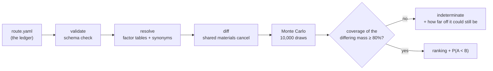
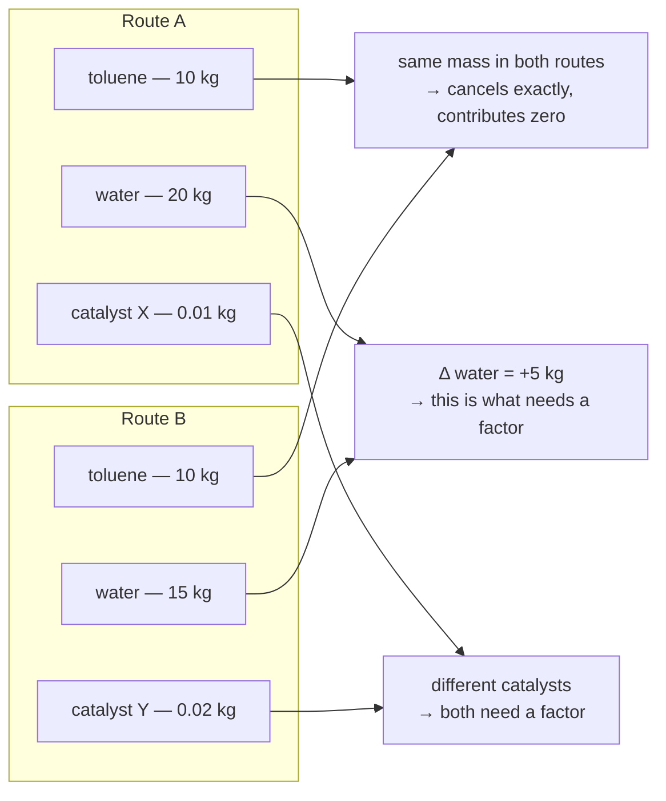

<!-- markdownlint-disable MD013 -->
<p align="right"><strong>English</strong> | <a href="README.ja.md">日本語</a></p>

# carbonroute

**Which of these two ways to make the same product has the lower carbon footprint — and how sure are we?**

`carbonroute` answers that question, and only that question. It does not try
to tell you the absolute carbon footprint of a synthesis — that needs
background data for every single input, most of which nobody can get for
free. It only needs data for what's *different* between two routes, because
everything the routes share cancels out. That is a much smaller, much
cheaper problem, and it is one public data can actually solve.

The answer always comes back as **a ranking and a probability** — "Route B is
very likely lower (P = 0.94)" — never a bare number, and never a guess when
the evidence doesn't support one.

> This is v0, and it is a screening tool, not a certification: its output is
> **not** an ISO 14067-conformant carbon footprint. See
> ["What this tool does not do"](#what-this-tool-does-not-do) and
> [`docs/limitations.md`](docs/limitations.md) before relying on it for
> anything.

```
pip install -e .
carbonroute compare route.yaml --a routeA --b routeB
```

---

## See it work — the 30-second version

Two invented routes to the same invented product, so you can run this
yourself right now with nothing but what's already in this repository:

```bash
carbonroute compare examples/route.yaml \
  --a legacy --b denovo \
  --factors examples/factors_illustrative.csv
```

```
## Conclusion

**New route is very likely lower** than Published route (P > 0.9999).

Delta (Published route - New route): median 126.4 kgCO2e/FU,
90% interval [70.94, 237.3], 10000 draws, seed 20240101.
```

Every one of those 10,000 draws is a full Monte Carlo simulation of "if the
real emission factors are anywhere in their plausible range, which route
wins this time?" Here, all 10,000 agree:

<p align="center">
  
</p>

Nothing here is production data — every factor in `examples/factors_illustrative.csv`
is an obviously fake round number, which the tool itself flags loudly in the
full report. It exists so you can see the whole pipeline run before you've
sourced a single real number of your own.

## How it works



The step that matters most is **diff**. Two routes to the same product
usually share a lot — the same solvent, the same reagent, sometimes the same
catalyst. None of that needs a citable emission factor at all, because it's
identical on both sides of the subtraction:



(This is the idea behind [DeltaLCA](https://arxiv.org/abs/2311.09611),
applied here to synthetic routes instead of electronics hardware.)

Everything a human has to decide — the electricity grid to assume, how much
solvent gets recovered, the GWP time horizon, what counts as a statistical
tie — lives in one place, the ledger's `assumptions:` block. Every step after
that is deterministic: the same ledger and the same factor tables always
produce the same numbers, down to the last decimal.

## See it prove itself — a real published comparison

The example above uses invented data. Here is what happens with a route
comparison from a real, peer-reviewed paper.

[Sorgenfrei et al., *J. Am. Chem. Soc.* **2025**, 147, 40944](https://doi.org/10.1021/jacs.5c14470)
(open access) computed the cradle-to-gate footprint of two real routes to the
antiviral **letermovir** — the industrial route used by Merck, and a novel
route the authors designed — using **ecoinvent**, a commercial database this
project cannot redistribute. They reported Merck at 382 kgCO₂e/kg and the new
route at 369, a **3% gap** in the new route's favor.

`carbonroute` can't see ecoinvent. It can only see what's openly licensed —
and that's the honest situation almost anyone doing this work actually
starts from. Watch what happens as more public sources get added to the
factor table, on the exact same two routes:

<p align="center">
  
</p>

At the first stage, the tool would have been *wrong* — with only 8.9% of the
differing mass resolved, the numbers it could see leaned toward Merck being
lower, opposite the published result. `carbonroute` refused to say so:

```
## Conclusion

**The comparison is undecided**, because only 8.9% of the differing mass
(2 of 43 materials) resolved to a factor, below the declared minimum of 80%.
No ranking is reported.
```

As real, citable public sources were added — and as the tool learned to
*derive* factors for chemicals no database had, from published production
recipes (see [`docs/bootstrap.md`](docs/bootstrap.md)) — coverage climbed to
**75.5%**, and the direction the evidence points flipped to agree with the
published paper. The verdict is still `indeterminate`, because 75.5% is
still short of the 80% the tool requires before it will commit to a ranking —
and that refusal is the point, not a shortcoming:

```
Resolved part of the difference: 50.28 kgCO2e/FU.
Unresolved differing mass: -4.205 kg/FU (signed).

The ranking reverses if the 4.205 kg/FU of unresolved material averages
more than 11.96 kgCO2e/kg. Compare that against the factors you do have
before treating the ranking as settled.
```

That's the tool telling you exactly how wrong the missing 24.5% would have
to be to change the answer — a number you can actually check your intuition
against, instead of a false sense of certainty. Full story, including why
this benchmark exists and what it caught, in
[`benchmarks/README.md`](benchmarks/README.md).

Letermovir isn't a cherry-picked example. Two more real, peer-reviewed
route comparisons — ibuprofen (52.9% coverage) and a ZIF-8 metal-organic
framework (6.8% coverage) — were run through the same pipeline and hit the
same wall: public factor coverage for specialty solvents is thin, so the
tool declines to rank rather than guess. See
[`examples/case-studies/`](examples/case-studies/) for both, including one
candidate paper that was investigated and rejected because its own
underlying data was AI/ML-modeled rather than measured.

## Install

Python 3.11 or later.

```bash
pip install -e .
```

Dependencies are limited to `pydantic`, `numpy`, `PyYAML`, and `click`.
RDKit is an optional extra (`pip install -e ".[chem]"`) used only to assist
material identification; it is never required to run the tool.

## The ledger

A route ledger is one YAML file. Its canonical shape is defined by
`src/carbonroute/schema.py` (pydantic models) and mirrored in
[`schemas/route-ledger.schema.json`](schemas/route-ledger.schema.json) for
external validation.

```yaml
schema_version: "0.1"

assumptions:
  functional_unit: {mass_kg: 1.0, basis: product}
  boundary: cradle-to-gate
  grid_factor:
    id: JP-2024
    value_kgCO2e_per_kWh: 0.43
    source: "Analyst-declared placeholder; replace with the grid factor you can cite."
    uncertainty_class: assumption
  gwp_method: {name: IPCC-AR6, horizon_years: 100, feedbacks: false}
  solvent_recovery_default: 0.0
  waste_treatment: excluded
  monte_carlo: {iterations: 10000, seed: 20240101}
  indeterminate_band: {low: 0.4, high: 0.6}

routes:
  legacy:
    label: "Published route"
    steps:
      - id: 1
        yield: 0.82
        inputs:
          - {name: toluene, cas: "108-88-3", mass_kg: 12.0, role: solvent}
          - {name: "substrate A", cas: null, mass_kg: 1.0, role: reactant}
        electricity_kWh: 30.0
  denovo:
    label: "New route"
    steps: [...]
```

Points worth knowing:

- `mass_kg` on an input is what was actually charged in that step. The tool
  scales it to the functional unit by dividing by the cumulative yield of
  every downstream step (spec section 7.1); you never do that arithmetic
  yourself.
- `role` is one of `solvent`, `reactant`, `reagent`, `catalyst`, `auxiliary`,
  used for the contribution breakdown by role.
- `cas` should be filled in whenever known — it is the primary join key
  against the factor table and against the same material appearing in a
  different route or step. A material without a CAS falls back to a
  normalized-name key, which is a weaker match and reported as such.
- `assumptions.solvent_recovery_default` (and the per-material
  `solvent_recovery` override) sets how much of a solvent's charged mass is
  treated as make-up rather than fresh input (spec section 7.2). The
  default is 0 — no recovery is assumed unless you say so.
- `routes` must be linear step lists. v0 has no way to express a route
  where two branches converge; see below.

The complete route ledger is the only place assumptions are allowed to
live. There is no other configuration surface for them.

## The commands

| Command | What it does |
| --- | --- |
| `carbonroute validate route.yaml` | Schema check only. No factor lookup, no computation. |
| `carbonroute resolve route.yaml [--show-missing]` | Looks every material up in the factor table(s); reports what matched and what didn't. No emissions math. |
| `carbonroute coverage route.yaml --a A --b B` | How much of the A-vs-B differing mass the loaded tables can actually reach, by count and by mass. Exits 3 if anything is unresolved. |
| `carbonroute compare route.yaml --a A --b B -o report.md` | The full comparison: diff, Monte Carlo ranking, reversal thresholds. Writes the report. |
| `carbonroute bootstrap --processes data/processes -o out.csv` | Derives factors for substances no open database covers, from production recipes — see [`docs/bootstrap.md`](docs/bootstrap.md). |
| `carbonroute lock route.yaml -o route.lock.json` | Pins the factor table versions, every resolved value and its provenance, and the RNG seed, so someone else can reproduce the exact numbers later. |

`resolve`, `coverage`, `compare`, `lock` and `bootstrap` accept
`--factors PATH` (repeatable; defaults to every CSV under `data/factors/`) and
`--synonyms PATH` (defaults to every CSV under `data/synonyms/`, which maps
the names a ledger uses onto identifiers — see [`docs/data.md`](docs/data.md)).
`compare` and `lock` accept `--uncertainty PATH` (defaults to the bundled
`config/uncertainty.yaml`); `resolve` does not, because it never touches the
uncertainty model. `compare` additionally takes `--iterations`, `--seed` and
`--no-thresholds`. `validate` takes no options. A `--fetch` flag exists on
`resolve` and `compare` for a future network-backed factor lookup; in v0 it
exits with an error, because **network access is off by default and there is
no code path in this tool that opens a socket.** The only side effect any
command has is writing the file named by `-o`; without `-o`, output goes to
stdout.

### The full worked example

```bash
# 1. Structural check only.
carbonroute validate examples/route.yaml

# 2. See what resolves against the illustrative factor table, and what
#    would be missing if it were the only table available.
carbonroute resolve examples/route.yaml \
  --factors examples/factors_illustrative.csv \
  --show-missing

# 3. Compare the two routes and write a Markdown report.
carbonroute compare examples/route.yaml \
  --a legacy --b denovo \
  --factors examples/factors_illustrative.csv \
  -o report.md

# 4. Pin the exact factor values, versions, and RNG seed used, for
#    someone else to reproduce.
carbonroute lock examples/route.yaml \
  --factors examples/factors_illustrative.csv \
  -o route.lock.json
```

`report.md` opens with a statement that the result is not an ISO
14067-conformant calculation, the full text of the assumptions applied, the
factor table versions and their SHA-256 hashes, and the provenance
breakdown of the resolution — in that order — before it states any
conclusion. Because every row in `examples/factors_illustrative.csv` is
marked `ILLUSTRATIVE`, the report also carries a prominent warning that its
conclusion is not usable for anything beyond exercising the pipeline. The
conclusion itself is always a ranking and a probability
(`P(GWP_legacy < GWP_denovo)`, a verdict of `"A<B"` / `"B<A"` /
`"indeterminate"`, and the median and 90% interval of the difference) —
never a single absolute footprint presented as the headline result.

## What this tool does not do

This list is deliberate, not an oversight, and it is unlikely to shrink
quickly (see `docs/spec-ja.md` section 5.2 and `docs/limitations.md`).
v0 does not:

- **Handle convergent routes.** Only linear step sequences are supported.
  A route where two synthesis branches merge into one cannot be expressed
  in the ledger schema at all.
- **Extrapolate from lab scale to plant scale.** Inputs are taken at face
  value from the ledger; there is no model for how solvent use, heating
  efficiency, or yield change between a bench reaction and an industrial
  process.
- **Model the use phase or end-of-life.** The boundary is fixed at
  cradle-to-gate. Nothing downstream of the product leaving the gate is in
  scope.
- **Cover impact categories beyond climate change.** The only output
  quantity is GWP (kg CO2e). Water use, toxicity, land use, and every other
  ISO 14044 impact category are out of scope.
- **Use a language model anywhere in the calculation path.** No factor
  value, no resolution decision, and no number in a report is ever produced
  or adjusted by a language model. This is a deliberate response to
  measured unreliability of general-purpose LLMs on LCA-adjacent tasks
  (arXiv:2510.19886 found 37% of answers across 11 models and 22 LCA tasks
  contained inaccurate or misleading content, with fabricated-citation
  rates up to 40% for some models).
- **Generate routes by retrosynthesis.** `carbonroute` compares routes you
  give it; it does not propose or search for candidate syntheses.

And separately from the list above: **the output of this tool is not an
ISO 14067-conformant product carbon footprint.** It is a screening
comparison meant to help decide which route deserves a full assessment, not
a substitute for one. Every report says so explicitly, as required by spec
section 9.

## What is in `data/factors/`

`data/factors/` ships real emission factors, every one of them fetched from
an openly licensed source by a script in `scripts/` that you can re-run to
regenerate the table. Each row names the dataset and the record it came
from, the licence it is distributed under, the date it was retrieved, and —
where the source published one — its own uncertainty.

At the time of writing that means **27 substances** from five sources:
ADEME's Base Carbone (Licence Ouverte), the US LCI Database (US government
work), ProBas/GEMIS (German environment agency, free for all users and
uses), figures published directly by producers and industry associations
(PlasticsEurope eco-profiles, a Nobian EPD), and `carbonroute bootstrap`
itself, deriving factors for chemicals none of those databases cover from
cited production recipes (2-MeTHF, ethyl acetate, isopropyl acetate,
acetone, DMF, MTBE, triethylamine and more — see
[`docs/bootstrap.md`](docs/bootstrap.md)).

Several of those substances carry two or more independent public values,
and they don't always agree — hydrochloric acid, for instance, is 1.199
kgCO2e/kg by one source and 1.700 by another. Reports print every value in
play. How far openly available data spreads for the same material is one
of the things worth knowing here, not something to average away.

**The coverage is still small relative to a real pharmaceutical route** —
see the letermovir example above. Openly licensed, independently citable,
per-kilogram cradle-to-gate factors for fine-chemical solvents and reagents
are genuinely scarce; most of what the field uses day to day sits in
commercial databases this project may not redistribute
([`docs/what-others-do.md`](docs/what-others-do.md) covers who has them and
why, and how to point `carbonroute` at a licensed table if you have one).
`carbonroute coverage` tells you exactly how far your own comparison is from
80%, so the gap is a number in front of you rather than a silent omission.
Adding a source means writing another ingestion script — see
[`docs/data.md`](docs/data.md) and
[`docs/sources-investigated.md`](docs/sources-investigated.md), which
records what was already checked and why it was or wasn't used.

Nothing here is estimated, interpolated, or recalled from memory. That is a
consequence of the "public data only, nothing invented" rule (spec sections
2 and 13): a table of plausible-looking numbers nobody can check would
defeat the entire purpose of the tool.

`examples/factors_illustrative.csv` exists purely so the pipeline can be
run end to end. Every value in it is an obviously-fake round number, every
row's `source` column starts with `ILLUSTRATIVE`, and any report built from
it says so prominently. Do not cite it, and do not use it for anything but
exercising the commands above.

## Reproducing everything without a live API

`carbonroute` itself never touches a network — enforced by a test that parses
its import graph, not just claimed in prose. The scripts that *built*
`data/factors/` used to require one, though, and every one of ADEME's,
PubChem's, ProBas's and the Federal LCA Commons' APIs is outside this
project's control. Each ingestion script now has a `--offline` flag that
replays from a durable, committed snapshot under `data/raw/` instead of
touching the network — see
[`docs/reproducibility.md`](docs/reproducibility.md) for which snapshot
covers which source, and its one known gap.

The letermovir benchmark's entire empirical basis — a small, CC BY licensed
Excel workbook — is committed at
[`benchmarks/letermovir/source-material/`](benchmarks/letermovir/source-material/)
for the same reason: `scripts/extract_letermovir_ledger.py --offline`, with
no arguments at all, reproduces `benchmarks/letermovir/ledger.yaml`
byte-for-byte using only files already in this repository.

## Benchmarks

Two test sets, both with their acceptance conditions written before the
assertions (see [`benchmarks/README.md`](benchmarks/README.md) for the
full account of both).

**B1, the analytic case**, is small enough to check by hand. It pins the
functional-unit conversion, solvent make-up, the exact cancellation of
materials common to both routes, and bit-for-bit reproducibility from a
seed.

**B2, the letermovir comparison** is the one demonstrated above. It exists
because a benchmark written *before* the calculation code catches things a
benchmark written after cannot: before it existed, an unresolved material
was silently treated as worth zero, and on 8.9% of the differing mass the
tool reported `P > 0.9999` for the ranking opposite the one the paper
published. The coverage floor and the break-even calculation shown above
both exist because this benchmark ran first and failed.

## Further reading

- [`docs/data.md`](docs/data.md) — the factor-table format and how to build
  a table you can cite.
- [`docs/bootstrap.md`](docs/bootstrap.md) — deriving factors from
  production recipes when no database has them.
- [`docs/uncertainty.md`](docs/uncertainty.md) — how the Monte Carlo model
  works and the status of its parameters.
- [`docs/convergence.md`](docs/convergence.md) — how many Monte Carlo
  iterations are enough, and what has not yet been checked.
- [`docs/limitations.md`](docs/limitations.md) — what this tool can and
  cannot be expected to get right.
- [`docs/reproducibility.md`](docs/reproducibility.md) — the non-API route:
  reproducing every factor table without live network access.
- [`docs/what-others-do.md`](docs/what-others-do.md) — what industry LCA
  tools do instead, and how to plug a licensed database into this one.
- [`docs/spec-ja.md`](docs/spec-ja.md) — the full design specification
  (Japanese), the authority on intent for everything above.
- [`docs/internal-api.md`](docs/internal-api.md) — the module-level
  contract for contributors.

## License

Apache License 2.0. See [`LICENSE`](LICENSE). Code and data have separate
licensing: the code in `src/` is Apache-2.0; any factor table you add to
`data/factors/` carries whatever license its own source imposes, tracked
per row (see `docs/data.md`).
